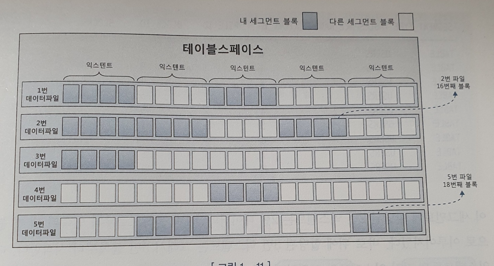

# 1. SQL 처리과정과 I/O

## 1.3 데이터 저장구조 및 I/O 메커니즘

### 1.3.1 SQL이 느린 이유

느린 이유? 거의 무조건 디스크 I/O 때문!!

I/O가 일어나면? 당연히 프로세스 잔다!

Single Block I/O 기준 평균 10ms 정도 걸림
-> 초당 100 블록 정도 읽는다!

**디스크 I/O 성능이 SQL 성능을 좌우한다!**


### 1.3.2 데이터베이스 저장 구조


우선 알고갈 키워드!

- 데이터 파일 : 디스크 상의 물리적인 OS 파일
- 테이블 스페이스 : 세그먼트 담는 컨테이너
  - 여러 개의 테이터파일로 구성
- 세그먼트 : 데이터 저장 공간이 필요한 오브젝트(테이블, 인덱스, 파티션, LOB 등)
  - 여러 익스텐트로 구성
- 익스텐트 : 공간을 확장하는 단위. 연속된 블록 집합
  - 테이블이나 인덱스에 데이터 넣다가 공간 부족하면 테이블 스페이스로부터 추가 익스텐트 할당받는다!
- 블록 : 데이터를 읽고 쓰는 단위
  - 익스텐트 단위로 공간을 확장하지만, 입력한 레코드를 실제로 저장하는 공간은 블록!
  - 한 블록에 저장된 레코드는 모두 같은 테이블의 레코드

세그먼트에 할당된 모든 익스텐트가 같은 데이터파일에 위치하지 않을 수도 있다!

파일 경합을 줄이기 위해서 데이터를 여러 데이터파일로 분산해서 저장하기 때문




### 1.3.3 블록단위 I/O

데이터 I/O 단위는 블록!

1바이트가 읽고 싶어도 1개 블록을 읽어야한다!

오라클의 1블록 크기 => 8kB


### 1.3.4 시퀀셜 액세스 vs 랜덤 액세스

테이블 접근 방식에는

- 시퀀셜 액세스
  - 논리적, 물리적 순서에 따라 블록을 읽음
  - 인덱스 leaf 블록은 앞뒤를 가리키는 주소값을 통해 연결되어있다!
    - (아마 B+ Tree 자료구조 leaf 노드를 말하는 것과 동일하지 않을까? 근데 앞뒤?? B+ Tree 리트 노드는 연결 리스트 아닌감?)
  - (오라클 경우) 세그먼트에 할당된 익스텐트 목록을 세그먼트 헤더에 맵(map)으로 관리
- 랜덤 액세스
  - 논리/물리적 순서를 따르지 않고 한 블록씩 접근하는 방식 (나중에 자세히 설명)


### 1.3.5 논리적 I/O vs 물리적 I/O

#### DB 버퍼 캐시

디스크 I/O 줄이기 위해서 캐싱은 필수!

라이브러리 캐시 외에도 DB 버퍼 캐시가 있다!

- 라이브러리 캐시 
  - SQL, 실행 계획, DB 저장형 함수, 프로시저 등을 캐싱 (코드 캐시)
- **DB 버퍼 캐시**
  - 읽은 데이터를 캐싱! (데이터 캐시)

데이터 블록을 읽을 땐 항상 버퍼 캐시부터 탐색!

적중하면? 디스크 I/O 발생 안하니 성능 UP!


#### 논리적 I/O vs 물리적 I/O

**논리적 블록 I/O : SQL 문을 처리하는 과정에서 메모리 버퍼 캐시에서 발생한 총 블록  I/O**

물리적 블록 I/O : 디스크에서 발생한 총 블록 I/O

메모리 I/O 는 전기적 신호, 디스크 I/O 물리적 신호(실제 액세스 암Arm 이 움직임) 보다 10,000배 빠름!


#### 버퍼캐시 히트율

버퍼캐시 효율을 구하기 위해선, 
전체 블록 중에서 물리적 디스크 I/O 없이 곧바로 메모리에서 찾은 비율!

```mathematica
BCHR = ( 캐시에서 곧바로 찾은 블록 수 / 총 읽은 블록 수 ) * 100
     = (( 논리적 I/O - 물리적 I/O ) / 논리적 I/O) * 100
     = ( 1 - (물리적 I/O) / (논리적 I/O)) * 100
```

어플리케이션 특성에 따라 다르지만, 
**온라인 트랜잭션 처리하는 앱이라면 시스템 레벨에서 평균 99% 히트율을 달성해야한다!**
(말이 99%지, 어려운 수준은 아니라고 함!)

SQL 성능을 높이기 위해서 **우리는 물리적 I/O보다는 논리적 I/O를 줄이는 것에 집중해야한다!**

~~물리적 I/O 성능 어떻게 줄일래...~~

논리적 I/O를 줄이면 총 블록 개수를 줄인다! -> 물리적 I/O도 자연스레 감소 -> 전체 성능 향상!

#### 주의!

BCHR 높다고 무조건 SQL 효율이 좋지는 않다!
캐시는 적중했지만 그 방법 자체가 비효율적이였을지도..
(뒷 장에서 추가로 학습하자 - 같은 블록을 반복해서 읽는 비효율)


### 1.3.6 Single Block I/O vs Multi Block I/O

- **Single Block I/O**

  - 한 번에 한 블록씩 요청해 메모리에 적재

  - 인덱스를 이용할 때는 모두 이 방식을 사용

    - 인덱스 루트 블록 읽을 때
    - 인덱스 루트 블록으로 얻은 주소 정보로 브랜치 블록 읽을 때
    - 인덱스 브랜치 블록으로 얻은 주소 정보로 리프 블록 읽을 때
    - 인덱스 리프 블록으로 얻은 주소 정보로 테이블 블록 읽을 때

    

- **Multi Block I/O**

  - 한 번에 여러 블록 적재
  - 많은 데이터를 읽을 때 효율적인 방식
  - 인덱스를 이용하지 않고 테이블 전체를 읽을 때 매우 좋다! 
  - 테이블 클수록 Multi Block I/O 단위 크면 좋다
    - 당연히! 프로세스 잠자는 횟수 줄겠지!

#### Q. 그렇다면, 대용량을 읽는다면?? 

A. index가 READ 에 장점이 있지만, Single BLOCK I/O 할래? Multi BLOCK I/O 해서 한번에 여러 블록 읽을래?

바로 뒤 1.3.7 에 이어서...


### 1.3.7 Table Full Scan vs Index Range Full Scan

테이블에 저장된 데이터를 읽는 방식

- Table Full Scan
- Index Range Scan

어떤게 더 좋을까??

#### Q. 많은 데이터를 읽을 때는 무엇이 좋을까?

1. **(Ans)Table Full Scan**

시퀀셜 액세스와 Multi Block I/O 방식으로 디스크 읽는다.

한 블록에 속한 모든 레코드를 한번에 읽고, 캐시에서 못찾으면 한번 I/O를 통해 다수의 블록을 처리하는 방법!


2. Index Range Scan

랜덤 액세스와 Single Block I/O방식을 사용한다. 읽었던 블록을 반복해서 읽기도 하기 때문에 당연히 안좋음!

즉, 적은 양의 데이터를 찾을 때는 효율적이지만, 어느 정도 이상의 데이터를 읽으면 Table Full Scan이 더 유리하다!


### 1.3.8 캐시 탐색 메커니즘

Direct Path I/O를 제외하고 모든 블록 I/O는 메모리 버퍼 캐시를 거친다! 그러면 캐시는 어떻게 탐색하지?

- 인덱스를 이용할 때 
  - 인덱스 루트 블록 읽을 때
  - 인덱스 루트 블록으로 얻은 주소 정보로 브랜치 블록 읽을 때
  - 인덱스 브랜치 블록으로 얻은 주소 정보로 리프 블록 읽을 때
  - 인덱스 리프 블록으로 얻은 주소 정보로 테이블 블록 읽을 때
- 테이블 블록 Full Scan 할 때

**버퍼 캐시 구조는 해시 구조로 관리한다!**

- **해시 구조  특징이 뭔데?**
  - 같은 입력에는 같은 값을 갖는다.
  - 삽입, 삭제, 검색이 평균 O(1) 값을 갖는다! (물론 체이닝 되면 선형검색해야하니까 평균 O(1) 이라고 표현!)

- 이 때 value 에 해당 값을 그대로 저장하지 않고, 버퍼의 헤더 값을 저장하고 있다!
  이 헤더 값을 통해 포인터로 버퍼 블록에 접근한다!


#### 메모리 공유자원에 대한 액세스 직렬화

버퍼 캐시는 SGA 구성요소 -> 모든 프로세스에게 공유 자원!

**동기화 문제 발생!**

여기서는 직렬화 메커니즘으로 해결한다!

래치라는 것으로 동기화 문제 해결한다!

혹은, 버퍼 lock 으로도 해결 가능! 