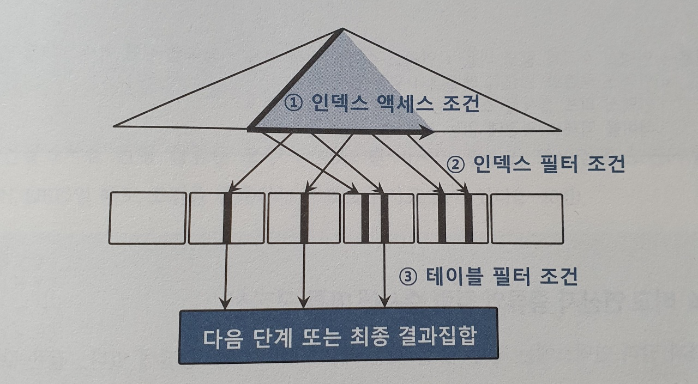

# 3.3 인덱스 스캔 효율화

테이블 랜덤 액세스 최소화하기 위한 튜닝 -> 인덱스 컬럼 추가!

인덱스 스캔 효율화를 위해선? 지금부터 배워보자!


## 3.3.1 인덱스 탐색

탐색 과정 복습!

- 수직적 탐색 
  - 인덱스 스캔 시작점을 찾는 방법이기 때문에 `where C1 = 'B'`를 마주친 블록이 가리키는 블록으로 내려가는 것이 아닌, **그 직전 블록이 가리키는 블록으로 내려가야한다.**
- 수평적 탐색
  - 범위에 맞게 리프 블록에서 탐색


## 3.3.2 인덱스 스캔 효율성

"성능개선" 이라는 단어에 대해서,
검색을 진행한다. 각 음절에 대해테이블 컬럼 형태로 저장되어 있다고 할 때,

```sql
/*case 1*/
where 
c1 = "성" and
c2 = "능" and
c3 = "개" 

/*case 2*/
where 
c1 = "성" and
c2 = "능" and
c4 = "선" 
```

1번 케이스보다 2번 케이스가 더 많은 range를 스캔하게 된다!

인덱스 선행 컬럼이 조건절에 없기 때문!
*(C4 컬럼보다 앞선 선행 컬럼 C3 가 2번 케이스 조건절에 없기 때문!)*

**인덱스 선행 컬럼이 조건절에 없거나, '=' 조건이 아니면 인덱스 스캔 과정에 비효율이 발생**

### 인덱스 스캔 효율성 측정

스캔 효율이 좋은지 알려면 SQL 트레이스를 통해 쉽게 알 수 있다.


## 3.3.3 액세스 조건과 필터 조건



- 인덱스 액세스 조건
  - **인덱스 스캔 범위를 결정**하는 조건절
  - 수직적 탐색을 통해 스캔 시작점을 결정 및 수평적 스캔 종료점을 결정!
- 인덱스 필터 조건
  - **테이블로 액세스할지를 결정**하는 조건절

#### 추가) 옵티마이저의 비용 계산 원리

7.1 절 내용)

인덱스를 이용한 테이블의 액세스 비용

```mathematica
비용 = 인덱스 수직적 탐색 비용 + 인덱스 수평적 탐색 비용 + 테이블 랜덤 액세스 비용
		= 인덱스 루트와 브랜치 레벨에서 읽는 블록 수 
			+ 인덱스 리프 블록을 스캔하는 과정에 읽는 블록 수 
      + 테이블 액세스 과정에 읽는 블록 수
```


## 3.3.4 비교 연산자 종류와 컬럼 순서에 따른 군집성

비교 연산자가 '=' 으로 조회하면 조건절을 만족하는 레코드는 모두 모여있다!

하지만 범위검색 조건으로 하게 된다면?

```sql
where c1 = 1
and c2 = 'A'
and c3 between 'a' and 'c'
and c4 = 'a'
```

중간 컬럼에 범위 조건을 넣었을 때 c1 ~ c3 에 해당하는 인덱스 레코드는 모두 모여 있지만, c4 조건을 보면 흩어지게 된다!

#### 규칙

선행 컬럼이 모두 '=' 조건인 상태에서 첫 번째 나타나는 범위검색 조건까지만 만족하는 인덱스 레코드는 모두 연속해서 모여 있지만, **그 이하 조건까지 만족하는 레코드는 비교 연산자 종류에 상관없이 흩어진다.**


## 3.3.5 인덱스 선행 컬럼이 등치(=) 조건이 아닐 때 생기는 비효율

위에서 본 것처럼, 인덱스 레코드가 모두 연속해서 모여 있는 것이 좋다!

리프 블록을 스캔하면서 읽은 레코드는 하나도 걸러지지 않고 모두 테이블 액세스로 이뤄지므로 인덱스 스캔 단계에서 비효율은 없다!

> 싱글 블록 I/O에서 같은 블록 내에 여러 레코드 있으니까 블록 I/O가 줄어드니까!
> 여러 블록에 흩어져 있으면 더 비효율적이겠지!

일부 인덱스 컬럼이 조건절에 없거나 '=' 조건이 아니더라도, 뒤쪽 컬럼 일수록 비효율 없다!


## 3.3.6 BETWEEN 을 IN-List 로 전환

범위 검색 컬럼이 맨 뒤로 가도록 인덱스를 바꾸는 것은 좋겠지만, 
운영 환경에선 인덱스 구성을 바꾸기 어렵다!

BETWEEN 조건절의 값이 OR 조건으로 바꿀 수 있다면? -> IN-List 로 바꿀 수 있다는 뜻!

>  2.2절에서 봤던 내용!
> OR 조건식을 옵티마이저 레벨에서 union_all 하여 인덱스 range 스캔을 개선했었다!
>
> 무조건 되는 것은 아니다!
>
> ```sql
> where col = in (1, 2, 3)
> ```
>
> 처럼 컬럼이 int 타입인 경우엔 가능! float 이였다면..? 불가능!

또한, IN-List 개수가 많다면? 매우 곤란....


### BETWEEN 조건을 IN-List 로 전환할 때 주의사항

**IN-List 개수가 많으면 인덱스 수직적 탐색이 많이 발생!**

BETWEEN 때문에 리프 블록을 많이 스캔하는 비효율 보다 
브랜치 블록을 탐색해야하는 수직적 탐색 비효율이 더 클 수 있다!

무조건 BETWEEN 을 IN-List로 바꾸는 것이 좋은게 아니다!

**인덱스 스캔 과정에서 선택되는 레코드들이 서로 멀리 떨어져있을 때만 유리!** 


## 3.3.7 Index Skip Scan 활용

**2.3.4 에서 봤었다!**

> 인덱스 선두 컬럼을 조건절에 안쓰면? 옵티마이저는 Table Full Scan or Index Full Scan~
> 오라클에선 인덱스 선두 컬럼이 조건절에 없어도 인덱스를 사용하고자, 
> **Index Skip Scan**을 만들었다!
>
> **가능성이 있는 리프 블록만 액세스!**

위에까지 BETWEEN 조건을 IN-List 로 바꾸면 도움이 되는 상황!
그런데 바꾸지 않고도 같은 효과를 낼 수 있다!

```sql
SELECT COUNT(*)
FROM 월별고객별판매집계 T
WHERE 판매구분 = 'A'
AND 판매월 BETWEEN '201801' AND '201812'
```

위 쿼리에서 최적의 수행을 하려면?
인덱스가 (판매구분, 판매월) 형태로 구성되어야 할 것!

하지만, (판매월, 판매구분)으로 구성할 경우
**판매구분='A'인 데이터가 소량**일 경우 (201801, 'A') 와 (201802, 'A') 사이 간격이 매우 넓을 것!

Range Scan 하면서 'A' 가 아닌 레코드를 대량으로 읽으면서 확인하기 때문에 I/O 가 많이 발생!

**이를 개선하려면!**

1. In - List 로 개선 가능! 
   - 힌트 이용하여 OR 조건의 union_all 로 처리!
2. index_ss 를 통해 index skip scan 유도!


## 3.3.8 IN 조건은 '=' 인가?

IN 조건은 '=' 와 정말 동등한지 예시를 통해 알아보자!

```sql
select * 
from 고객별가입상품
where 고객번호 = :cust_no
and 상품ID in ('1', '2', '3')
```

고객별가입상품 테이블에서 고객번호의 평균 카디널리티는 3 이라고 가정!
( 고객별로 평균 3건의 상품을 가입)

### 인덱스를 [상품ID, 고객번호]로 생성할 때

같은 상품은 고객번호 순으로 정렬된 상태로 한 개의 리프 블록에 저장.

-> 고객번호가 1234 인 레코드는 상품 ID 에 따라서 흩어져서 저장될 수 있다

- 이 경우, 상품 ID 조건절은?
  - IN-List 조건절로 해결하는 것이 효과적!


### 인덱스를 [고객번호, 상품ID]로 생성할 때

고객번호가 1234 인 레코드에서, **상품ID가 1, 2, 3 인 레코드는 한 리프 블록에 저장되어 있다.**

그런데! IN-List Iterator 방식으로 풀 경우 '=' 조건이 되며
**같은 리프 블록에 있는 레코드까지 찾아가는 수직적 탐색 과정을 3번 거치게 된다!**
불필요한 작업!!

> 버퍼 피닝으로 잡고 있으면 되는거 아닌가?
> 헷갈려....

IN-List가 아닌 필터 조건으로 처리할 경우 리프 블록까지 접근하는 수직적 탐색 과정이 1번만 필요하다!


####  IN 조건은 '='이 아닌 필터 조건이다.

IN-List 방식으로 의미 있으려면?

- 고객별 상품 데이터가 아주 많아야한다. 


### NUM_INDEX_KEYS 힌트 활용

`NUM_INDEX_KEYS` : 액세스조건으로 사용할지, 필터조건으로 사용할지 유도하는 힌트!

```sql
SELECT /*+ NUM_INDEX_KEYS(a <index_name> 1)*/ *
FROM 고객별가입상품 a
```

힌트의 세 번째 인자가 1이면, 인덱스 첫번째 컬럼까지만 액세스 조건으로 사용!


## 3.3.9 BETWEEN 과 LIKE 스캔 범위 비교

**LIKE 와 BETWEEN 둘 다 범위검색 조건!**
앞에서 말한 비효율 원리가 동일!
하지만, 데이터 분포와 조건절에 따라 인덱스 스캔량이 다를 수 있다!

**BETWEEN이 거의 무조건 LIKE 보다 낫다!!**

예를 통해 확인!

```sql
/*case 1*/
WHERE 판매월 BETWEEN '201901' AND '201912'
AND 판매구분 = 'B'

/*case 2*/
WHERE 판매월 LIKE '2019%'
AND 판매구분 = 'B'
```

위의 경우만 확인해도 한 눈에 알 수 있다!

>  2번의 경우 201900 인지, 전부 다 확인해야 하므로 201899 와 같은 블록에서 탐색을 시작하는 느낌!


## 3.3.10 범위 검색 조건을 남용할 때 생기는 비효율

사용자 입력에 따른 조건절이 다양하게 바뀔 때 조건절을 모두 LIKE 로 구현하면 편할 수 있다.
하지만! 해당 컬럼이 인덱스 구성 컬럼일 때는 특히 주의 필요!!

**예시**

- 가입상품 테이블
  - 회사 코드, 지역코드, 상품명 컬럼
  - 조회시 회사코드는 필수, 지역코드는 선택
  - 상품명 단어는 일부만 입력 가능

```sql
# 회사 코드, 지역코드, 상품명 입력
SELECT *
FROM 가입상품
WHERE 회사코드 = :com
AND 지역코드 =:reg
AND 상품명 LIKE :prod || '%'

# 회사코드, 상품명만 입력
SELECT *
FROM 가입상품
WHERE 회사코드 = :com
AND 상품명 LIKE :prod || '%'
```

둘 중 한개의 쿼리를 선택적으로 이용할 예정

**인덱스를 [회사코드, 지역코드, 상품명] 으로 구성**

1번 쿼리로 할 경우 적은 범위를 스캔하여 빠르게 결과 출력 가능

2번으로 할 경우, 1번에 비해 넓은 범위 스캔

만약 LIKE 연산자를 지역코드 컬럼에 썼다면?

```sql
SELECT *
FROM 가입상품
WHERE 회사코드 = :com
AND 지역코드 LIKE :reg || '%'
AND 상품명 LIKE :prod || '%'
```

지역코드를 입력하지 않은 경우보다, 입력한 경우가 스캔을 더 많이 한다!

**즉 LIKE 연산자를 쓰면 오히려 더 많이 스캔하는 비효율이 생길 수도 있으므로 주의해야한다!**

개발 생산성은 좋아질 수도 있지만, 스캔 효율은 낮아질 수도!

## 3.3.11 다양한 옵션 조건 처리 방식의 장단점 비교

옵션 조건은 매우 많음!

### OR 조건 활용

```sql
select * from 거래
where (:cust_id is null or 고객ID = :cust_id)
and 거래일자 between :dt1 and :dt2
```

#### 문제점

옵티마이저에 의한 쿼리 변환이 기본적으로 동작X
옵션 조건 컬럼을 선두에 두고 인덱스를 구성해도 사용 불가!
**( [고객ID, 거래일자]를 인덱스로 지정해도 사용할 수 없다!! )**

**따라서 인덱스 선두 컬럼에 대한 옵션 조건에 OR 조건을 사용해선 안된다**.

**OR 조건을 활용한 옵션 조건 처리**

- 인덱스 액세스 조건으로 사용 불가
- 인덱스 필터 조건으로도 사용 불가
- **테이블 필터 조건으로만 사용 가능**
- 단, 인덱스 구성 칼럼 중 하나 이상이 Not Null 컬럼이면 
  18c부터 인덱스 필터 조건으로 사용 가능

> 18c 가 뭐지? -> 오라클 db 버전 ㅋㅋ


### LIKE/BETWEEN 조건 활용

변별력이 좋은 필수 조건이 있는 상황에서 LIKE/BETWEEN을 쓰는 것은 괜찮음.

필수 조건 컬럼을 인덱스 선두에 두고 액세스 조건으로 사용하면, 
LIKE/BETWEEN 이 인덱스 필터 조건이어도 충분히 좋은 성능을 낼 수 있기 때문!

그러나, 필수조건의 변별력이 좋지 않다면? 
LIKE/BETWEEN을 사용하고자 한다면 아래 4가지 경우도 확인해봐야 한다!

1. 인덱스 선두 컬럼
2. NULL 허용 컬럼
3. 숫자형 컬럼
4. 가변길이 컬럼

#### **1. 인덱스 선두 컬럼**에  LIKE/BETWEEN 으로 처리하면 안된다.

**옵션조건을 LIKE/BETWEEN 으로 하는 것은 매우 좋지 않음!**

**예시**

```sql
select * from 거래
where 고객ID like :cust_id || '%'
and 거래일자 between :dt1 and :dt2
```

인덱스 : [고객ID, 거래일자]

- **고객 ID를 입력한 경우**
  - 조건 범위컬럼 둘 다 범위검색 조건으로 스캔 
  - 비효율? 당연히 있을 수 있음. But 고객 ID 가 변별력이 있어서 빠르게 조회 가능
- **고객 ID 입력하지 않은 경우**
  - Index Full Scan 발생
  - 거래 일자 조건으로 필터링 진행
  - 이 경우에는 [거래일자, 고객ID] 로 인덱스 구성하는 것이 좋음
    - 물론, 고객 ID 가 검색될 때 비효율은 감수해야함...


#### 2. NULL 허용 컬럼에 대한 옵션 조건을 LIKE/BETWEEN 으로 처리하면 안된다.

**성능을 떠나 결과 집합에 오류!**

```sql
select * from 거래
where 고객ID like '%'
and 거래일자 between :dt1 and :dt2
```

거래일자 조건에 해당하는 모든 고객의 거래를 선택해야 하는 상황에서, 
**고객id 가 null 이라면 결과 집합에서 누락된다!**

#### 3. 숫자형이면서 인덱스 액세스 조건으로 사용가능한 컬럼엔 LIKE를 쓰면 안된다.

> BETWEEN 은 된다!

```sql
select * from 거래
where 거래일자 = :trd_dt
and 고객ID like :cust_id || '%'
# 인덱스 :  [거래일자, 고객ID] 
```

- 위 상황에서 :cust_id 에 값을 입력한 경우 모두 인덱스 액세스 조건으로 사용 가능
- 그런데, 고객 ID 가 숫자형 컬럼이면 **자동 형변환으로 인해 고객 ID가 필터 조건으로 쓰인다!**
  - `AND TO_CHAR(고객ID) LIKE :cust_id || '%'`

>  옵티마이저가 자동으로 바꾸는 경우가 있고, 이 때 인덱스 컬럼이 가공되면? Range scan 불가능!


#### 4. LIKE를 옵션으로 사용할 때는 컬럼 값 길이가 고정이어야 한다.

```sql
WHERE 고객명 LIKE :cust_nm || '%'
```

고객명과 일치하지 않아도 조회될 수 있기 때문에
길이 조건을 추가해서 변수의 길이가 같은 레코드만 조회되도록 처리해야 한다.

> 길이 조건 관련해서 이건 서비스 특성에 따라 다르게 하지 않을까?


### UNION ALL 활용

```sql
select * from 거래
where :cust_id is null
and 거래일자 between :dt1 and :dt2
union all
select * from 거래
where :cust_id is not null
and 거래일자 between :dt1 and :dt2
```

:cust_id 변수에 값 입력 여부에 따라 sql 중 한개만 실행!

:cust_id 값의 입력에 따라서 
[거래일자] 인덱스 혹은 [고객ID, 거래일자]인덱스를 사용할지 선택할 수 있다.


### NVL/DECODE 함수 활용

nvl, decode 함수를 잘 활용하는 것도 좋다!

> nvl : 해당 컬럼값이 null 인 경우 값을 지정 
> **nvl('값', '지정값')**
>
> decode : if-else 기능
> **DECODE(컬럼, 조건1, 결과1, 조건2, 결과2, 조건3, 결과3...)** 

```sql
select * from 거래
where 고객ID = nvl(:cust_id, 고객ID)
and 거래일자 between :dt1 and :dt2

select * from 거래
where 고객ID = decode(:cust_id, null, 고객ID, :cust_id)
and 거래일자 between :dt1 and :dt2
```

> 그냥 함수를 써서 좋다! 가 아닌, 인덱스 스캔 효율화를 고려하고 있다는 점 잊지말자!

**nvl, decode를 쓰면 인덱스 컬럼을 가공한 것과 동일!**
근데 어떻게 가능하지?

**OR Expansion 변환이 옵티마이저에서 발생!**

만일 변환이 되지 않았다면 인덱스 조건으로 사용 불가능!


-----------

다양한 옵션 조건 패턴을 보았는데 매우 어려운 주제....

상황에 따라 잘 선택할 것!


## 3.3.12 함수 호출 부하 해소를 위한 인덱스 구성

### PL/SQL 함수의 성능적 특성

PL/SQL 사용자 정의 함수는 매우 느리다!

- 가상머신(VM) 상에서 실행되는 인터프리터 언어
  - PL/SQL 로 작성된 함수, 프로시저를 컴파일 하면 바이트 코드 생성하여 데이터 딕셔너리에 저장
  - PL/SQL엔진만 있으면 어떤 환경에서든 실행가능, 런타임 시 해석하면서 실행
  - **인터프리터 언어이므로, 네이티브 코드로 컴파일된 내장함수에 비해 많이 느림!**
- 호출 시마다 컨텍스트 스위칭 발생
  - PL/SQL 함수 실행 시 SQL 실행 엔진과 PL/SQL 가상머신 사이 컨텍스트 스위칭 발생
- 내장 SQL 에 대한 재귀 호출 발생 (Recursive Call)
  - **가장 결정적인 요소**
  - 정의 함수 내에 SQL 이 있다면 해당 SQL 이 재귀적으로 실행
    - SQL 만족하는 레코드가 100만개 -> 정의함수 내 SQL도 100만번 수행

**이렇게 3가지 이유, 특히 Recursive Call 때문에 매우 느리다.**


### 효과적인 인덱스 구성을 통한 함수 호출 최소화

조건절에 아래와 같이 PL/SQL 함수를 쓰면 encryption 함수는 테이블 건수만큼 수행된다.

```sql
select /* full(a) */ *
from 회원 a
where 암호화된_전화번호 = encryption(:phone_no)
```

다른 조건이 추가된다면?

```sql
select /* full(a) */ *
from 회원 a
where 생년 = '1987'
and 암호화된_전화번호 = encryption(:phone_no)
```

1987에 해당하는 레코드 수 만큼 함수가 수행된다!

**조건절을 통해서 함수 호출을 줄일 수 있다!**
**뿐만 아니라 인덱스 구성을 통해서도 가능!**

#### 인덱스 : [생년]

해당 인덱스를 타고 간 이후 
**암호화된 전화번호를 테이블 필터 조건으로 활용!**


#### 인덱스 : [생년, 생일, 암호화된 전화번호]

생일에 대한 '=' 조건이 없으므로 
**암호화된 전화번호 조건은 인덱스 필터 조건!**


#### 인덱스 : [생년, 암호화된 전화번호]

**인덱스 액세스 조건으로 사용**되므로 
encryption 함수는 1번만 호출!


