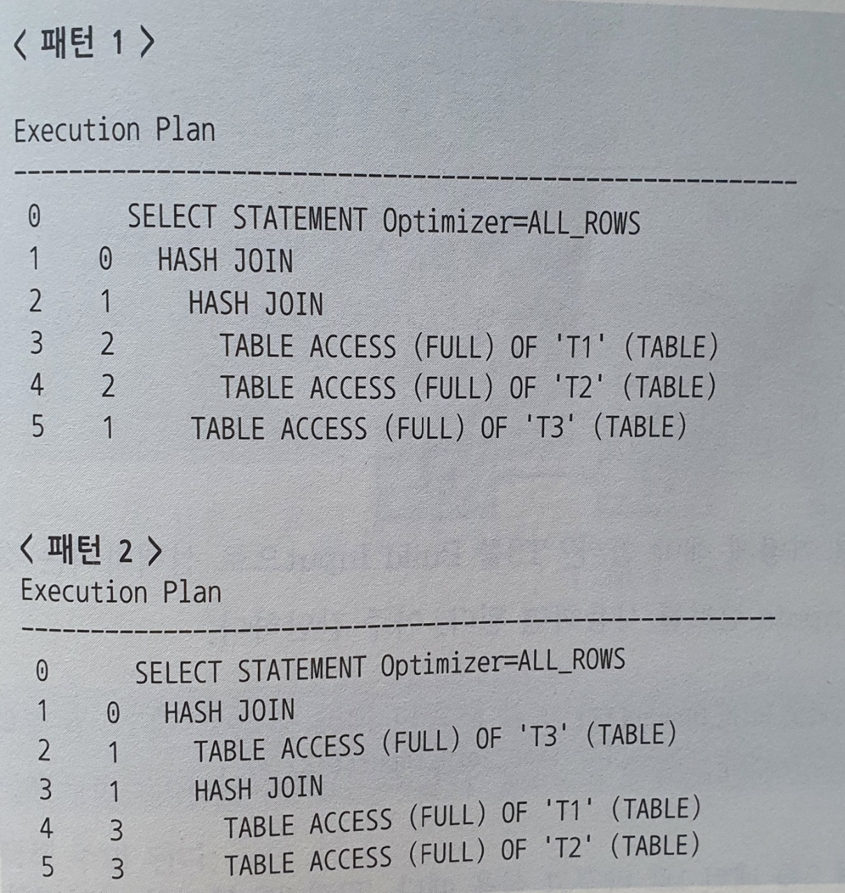

# 4.3 해시 조인

NL 조인은 인덱스를 이용한 조인 방식! 따라서 인덱스 구성에 따라 성능 차이 발생한다.

인덱스를 완벽하게 구성해도, 랜덤 IO로 인한 대량 데이터 처리에 불리.
버퍼 캐시 히트율 낮으면 성능도 낮다...

소트 머지와 해시 조인은 조인 과정에 인덱스를 쓰지 않기에 대량 데이터 처리에 좋고, 일정한 성능을 낸다!

소트머지

- 항상 양쪽 테이블 정렬 부담

해시조인

- 그러한 부담 없다!
- 그렇다고 모든 조인을 해시 조인으로..? 이건 불가능!

해시 조인의 기본 메커니즘, 실행계획 제어, 조인 메소드 선택 기준을 통해 확인해보자!


## 4.3.1 기본 메커니즘

해시 조인은 2단계로 진행!

1. Build 단계 : 작은 쪽 테이블(Build Input)을 읽어 해시 테이블을 생성
2. Probe 단계 : 큰쪽 테이블(Probe Input)을 읽어 해시 테이블을 탐색하면서 조인

```sql
SELECT /* ordered use_hash(c) */
	e.사원번호, e.사원명, e.입사일자
	c.고객번호, c.고객명, c.전화번호, c.최종주문금액
FROM 사원 e, 고객 c
WHERE c.관리사원번호 = e.사원번호 -- 1
AND e.입사일자 >= '19960101'   -- 2
AND e.부서코드 = 'Z123'        -- 3
AND c.최종주문금액 >= 20000     -- 4
```

위 sql 에서 과정을 보면,

1. build 단계 : 위 sql에서 작은 쪽 테이블(사원 e)을 읽어 해시 테이블을 생성한다.

   ```sql
   SELECT e.사원번호, e.사원명, e.입사일자
   FROM 사원 e
   AND e.입사일자 >= '19960101' 
   AND e.부서코드 = 'Z123' 
   ```

   **조인 컬럼인 사원 번호를 해시 테이블 키로 사용**한다!
   해시 함수로 변환된 키로 해시 체이닝.
   PGA 의 Hash Area 에 저장하는데, 
   해시 테이블이 너무 커 PGA 에 저장할 수 없다면 Temp  스페이스에 저장!

2. Probe 단계 : 고객 데이터를 하나씩 읽어 앞서 생성한 해시 테이블 탐색

   ```sql
   SELECT c.고객번호, c.고객명, c.전화번호, c.최종주문금액, c.관리사원번호
   FROM 고객 c
   AND c.최종주문금액 >= 20000
   ```

   조인컬럼이였던 관리사원번호를 해시 함수에 입력해 반환된 값으로 해시 체인을 찾고,
   해시 체인을 스캔해서 값이 같은 사원번호를 찾는다!
   찾으면 조인 성공!

> 조건에 맞는 테이블을 각 1번씩 스캔한다!
>
> Where 문 딱히 없이 조인이였다면? 테이블 full 스캔 했을듯...?!
> 인덱스 사용해서 탐색하면 더 좋지 않을까?


## 4.3.2 해시 조인이 빠른 이유

Hash Area 에 생성한 해시 테이블을 이용하는 점만 다르고,
해시 조인도 조인 프로세스는 NL 조인과 동일하다.

그럼에도 더 빠른 이유는? 해시 테이블을 PGA 영역에 할당하기 때문!
PGA에 할당하면 뭐가 좋아?
**래치 획득 과정이 필요 없음!**

> PGA는 독립적인 메모리 공간이므로 SGA 와 다르게 래치(Lock) 메커니즘 불필요! 

해시 조인도 각 테이블을 읽을 때 DB 버퍼 캐시를 경유하며, 인덱스를 이용하기도 한다.
**이 때 생기는 버퍼 캐시 탐색 비용과, 랜덤 액세스 부하는 피할 수 없다!**

> 위에서 했던 답 해결! 인덱스 들어가네!


### 해시테이블에 담기는 정보

***해시 테이블에는 조인 키만 저장하지 않는다!***

조인키 + SQL 에 사용한 컬럼 모두 저장한다!
**PGA 에서 조인하기 때문에 래치 획득 과정 없이 한다는 점이 매우 큰 장점이기 때문!!**


해시조인, 소트 머지 조인 둘 다 PGA 에서 처리하는데, 해시 조인이 더 빠르다!

알고리즘의 차이도 있으나 이는 미미한 정도,
**실질 차이는 조인 오퍼레이션 시작하기 전 사전 준비작업 때문!**

- 소트 머지 사전 작업
  -  양쪽 집합을 모두 정렬해서 PGA에 담는다.
  - PGA 자체는 그렇게 크지 않기에 Temp 테이블 스페이스, 즉 디스크에 쓰는 작업을 반드시 수반한다!
- 해시 조인 사전 작업
  - 양쪽 집합 중 한쪽을 읽어 해시맵을 만든다!
  - 둘 중 작은 집합을 해시 맵 build input 으로 선택하기에, 둘 다 PGA 내 Hash Area 에 못 담을 정도 아니라면 디스크 쓰는 작업 일어나지 않는다!
    - Hash Area를 초과하여 Temp 테이블 스페이스 쓰더라도, **대량 데이터 조인 시 해시 조인이 더 빠르다!**


## 4.3.3 대용량 Build Input 처리

2개의 대용량 테이블 T1, T2 에 대해서 조인을 진행해보자.
**Build Input이 Hash Area를 초과**하는 상황에선 우선 **인메모리 해시 조인은 불가능하다**!

이를 처리하기 위해선 분할 정복 방식으로 해시조인을 처리할 수 있다.

#### 1. 파티션 단계

조인하는 양쪽 집합의 조인 컬럼에 해시 함수를 적용, 반환된 해시 값에 따라 동적으로 파티셔닝한다!

독립적으로 처리할 수 있는 여러 개의 작은 서브 집합으로 분할하여 파티션 짝을 생성한다.

양쪽 집합을 읽으면서 디스크 Temp 공간에 저장해야 하므로 인메모리 해시 조인보다 성능이 많이 떨어진다.


#### 2. 조인 단계

각각의 파티션 짝에 대해서 하나씩 조인을 수행한다.
이 때 파티션 이전 상태의 Build Input 에 관계 없이
파티션 된 이후의 T1', T2' 만 가지고 작은 쪽을 Build Input 으로 사용하여 해시테이블을 생성하여 해시 조인을 수행한다.


## 4.3.4 해시 조인 실행 계획 제어

`use_hash` 라는 힌트를 사용하여 해시 조인이 가능한데, 이 때 build input 은 누가 정할까?
따로 알려주지 않았다면 build input 은 옵티마이저가 선택하며,
일반적으로 카디널리티가 작은 테이블을 선택한다!

만일 직접 선택하고 싶다면? 

`leading(e) use_hash(c)` 혹은 `ordered use_hash(c)` 와 같이 작성하면 된다.
오라클은 지시한 순서에 따라 가장 먼저 읽는 테이블을 Build Input 으로 선택한다!

#### 세 개 이상 테이블 해시 조인

조인방법: A ↔ B ↔ C

위와 같은 형태로 조인하게 된다.

단순히

```sql
select /* leading (T1, T2, T3) use_hash(T2) use_hash(T3) */
from T1, T2, T3
where T1.key = T2.key
and T2.key = T3.key
```

위에서 T1이 Build Input 으로 들어가면서 해시 조인이 이뤄진다.

이 때 실행계획 패턴이 2가지가 나온다!

> 실행 계획 패턴 여러 개...?
> 말 그대로 위 쿼리에 대해서 나올 수 있는 게 상황에 따라 2가지 중 1가지로 나온다는 뜻!



`leading(T1, T2, T3)` 에 의해서 T1 이 가장 먼저 Build Input 으로 들어가는 모습!

만약에 T2가 Build Input 으로 들어가길 원한다면 swap_join_inputs 를 사용하면 된다.

`select /* leading (T1, T2, T3) swap_join_inputs(T2) */`

> leading 순서가 T1, T2, T3 인데, build input을 T2 로 한다는게 뭐지...?


원리 : `/* leading (T1, T2, T3) use_hash(T2) use_hash(T3) */`

조인 연결고리를 따라 leading 으로 방향을 힌트에 기술한 뒤, Build Input 으로 선택하고 싶은 테이블이 있다면 ` swap_join_inputs(T2)` 를 힌트에 추가해 지정해주면 된다.
만일 Build Input 으로 선택하고 싶은데 이미 조인된 결과 집합이여서 지정하기 어렵다면,
`no_swap_join_inputs` 힌트로 반대쪽 prove input을 선택해줄 수 있다.

> 쉬운 것 같으면서도 어렵네..?


## 4.3.5 조인 메소드 선택 기준

해시 조인 좋으니까 인덱스 열심히 설계 안해도 되는거 아닌가?

이는 안좋은 생각!!!
수행 빈도가 매우 높은 쿼리에 대해선 특히 그렇다!

#### 선택 기준

```python
if (소량 데이터 조인)
  do NL조인
elif (조인 조건식이 등치(=))
	do 해시 조인
else
  do 소트 머지 조인
```

여기서 소량은 단순히 데이터 량이 아니라, 
**NL 조인 기준으로 최적화 했는데도 랜덤 액세스가 많아 만족할만한 성능을 내지 못할 때 대량 데이터 조인에 해당한다.**


#### 수행 빈도가 매우 높은 쿼리에 대한 기준

1. 최적화된 NL 조인과 해시 조인 성능이 같으면 NL 조인
2. 해시 조인이 약간 더 빨라도 NL 조인
3. NL 조인보다 해시 조인이 매우 빠른 경우, 해시 조인
   - 이 경우는 아마 대량 데이터일 확률 높음

SQL 최적화 시 옵티마이저가 수행 빈도까지 고려하지는 않으므로 이는 매우 중요한 선택 기준이다.


### 그럼 왜 NL 조인을 가장 먼저 고려해야 하는가?

인덱스를 세심하게 설계해야하는 등 부담도 있음에도 NL 조인을 최우선 고려해야 하는 이유는?

- **NL 조인에 쓰는 인덱스는 영구적으로 유지하면서 다양한 쿼리를 위해 공유 및 재사용 하는 자료구조**
- **해시 테이블은 하나의 쿼리를 위해 생성하고 조인이 끝나면 소멸하는 자료구조**
- 따라서 모두 해시 조인으로 처리하면 CPU와 메모리 사용률이 크게 증가하고,
  해시 맵 만드는 과정에서 래치 경합이 발생하기도 한다!

### 결론

해시 조인은 아래 3가지 조건 만족할 때 쓰자!

1. 수행 빈도 낮고
2. 쿼리 수행 시간 오래 걸리는
3. 대량 데이터 조인 할 때

OLTP 환경에서 NL 조인을 0.1초 걸린다고 0.01초로 줄이기 위해 해시 조인 쓰는 것은 자제하자...!