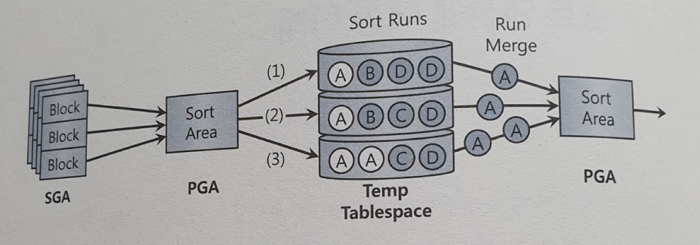

# 소트 연산에 대한 이해

SQL 수행 도중 가공된 데이터 집합이 필요할 때, PGA나 Temp 테이블 스페이스를 활용한다.

- 소트머지, 해시 조인, 데이터 소트와 그룹핑 등!

데이터를 소트하거나 그룹핑하는 과정을 보자!

## 5.1.1 소트 수행 과정

소트는 PGA의 메모리 공간인 Sort Area 에서 이뤄진다.
메모리 Sort Area가 다 차서 공간 부족하면? 디스크 Temp 테이블 스페이스 활용!

Sort Area 작업 완료 유형

1. 메모리 소트
   - 전체 데이터 정렬 작업을 메모리 내에서 완료, Internal Sort
2. 디스크 소트
   - 할당받은 Sort Area 에서 정렬을 완료하지 못해 디스크 공간까지 사용, External Sort

- 순서

- 소트할 대상 집합을 SGA 버퍼 캐시를 통해 읽고,
- PGA Sort Area 에서 정렬 시도
- 이후 ~~

**소트연산은 메모리 집약적 + CPU 집약적**

처리 데이터량이 많을 때는 디스크 IO발생 -> 쿼리 성능 좌우!
또한, 정렬한다면? 앞에서 배운 부분 범위 처리 불가! => 당연히 성능 저하!

> 페이징과 부분 범위 처리는 다르다! offset 주면서 읽는 페이징은 정렬된 데이터를 기반으로 근거한다!
> 나중에 부분 범위 처리 자세히 배우면 또 공부해보자!

## 5.1.2 소트 오퍼레이션

소트 튜닝을 설명하기 전에, 소트를 발생하는 오퍼레이션에 대해 보자!

### (1) Sort Aggregate

**전체 로우 대상으로 집계 수행할 때**

실제 데이터를 정렬하진 않고, Sort Area 만 이용한다!

> PGA (Process/Program/Private Global Area)
>
> - 프로세스에 종속적인 고유 데이터를 저장하는 용도
> - PGA 공간이 작아 데이터를 저장하지 못한다면, Temp 테이블 스페이스를 쓰기도 함
> - 독립적인 메모리 공간이므로 SGA 와 다르게 래치(Lock) 메커니즘 불필요!
>
> 

***PGA 구조***

- **Sort Area(정렬 공간)** - Order By 또는 Group By 등의 정렬을 수행하기 위한 공간이며 해당 공간에서만 정렬이 완료된다면 이를 메모리 정렬이라 한다. 해당 정렬 메모리 공간이 부족하다면 디스크를 이용하게 된다.

- **Session Information(세션 정보)** - 서버 프로세스에 의해 추출된 결과 값을 전달하기 위해 필요한 유저 프로세스의 세션 정보를 저장한다.

- **Cursor State(커서 상태 정보)** - 해당 SQL의 Parsing(파싱) 정보가 저장되어 있는 주소를 저장한다.

- **Stack Space(변수 저장 공간)** - SQL 문장에 Bind Variable(바인드 변수)를 사용했을경우 해당 Bind Variable를 저장하는 공간이다.

출처: https://1duffy.tistory.com/18 [밀림속의 동물원]

> Sort Area?? 집계함수니까 Group By ~~ Sort Area 쓸만하네~

과정을 보자!
집계함수의 값 구하는 절차를 보면,

1. Sort Area 에 SUM, MAX, MIN, COUNT 값을 위한 변수를 할당
2. 첫번 째 레코드에서 읽은 값을 SUM, MAX, MIN에 저장, COUNT 에는 1
3. 각각의 함수에 맞는 값으로 바꿔나간다

### (2) Sort Order By

**데이터를 정렬할 때**

### (3) Sort Group By

**소팅 알고리즘 이용해 그룹별 집계를 수행할 때**

집계할 대상이 많지 않다면 Sort  Area 를 많이 사용하거나, Temp 테이블 스페이스를 쓰지 않아도 된다.
그룹 대상에 맞는 만큼만 공간이 필요하다! 

Ex) 부서가 4개뿐인 회사에 부서별 급여를 집계할 때,

- 1,2,3,4 구분해두고 
  - SUM, MAX, MIN, COUNT 를 각각 채워나간다고 생각하면 된다!

이와 비슷하게 Hash 를 이용한 Hash Group By 도 존재한다.

### (4) Sort Unique

옵티마이저가 서브쿼리를 풀어 일반 조인문으로 변환하는 것을 '서브쿼리 unnesting'!
unnesting 된 서브쿼리가 M쪽 집합이면(다수), 메인 쿼리와 조인하기 전에 `Sort Unique` 통해 중복부터 제거!

또한 union, minus, intersect 등 집합 연산자에도 중복 제거 위해 Sort Unique 오퍼레이션이 나타난다.

### (5) Sort Join

소트 머지 조인 시 등장!

### (6) Window Sort

윈도우 함수 이용시 등장!

> 윈도우 함수란, 행과 행 간의 관계를 쉽게 정의하기 위해 만든 함수
>
> 1. 그룹 내 순위(RANK) 관련 함수: RANK, DENSE_RANK, ROW_NUMBER
> 2. 그룹 내 집계(AGGREGATE) 관련 함수 : SUM, MAX, MIN, AVG, COUNT (sql server는 OVER 절의 OREDER BY 지원 X)
> 3. 그룹 내 행 순서 관련 함수 : FIRST_VALUE, LAST_VALUE, LAG, LEAD (오라클에서만 지원)
> 4. 그룹 내 비율 관련 함수 : CUME_DIST, PERCENT_RANK, NTILE, RATIO_TO_REPORT 
>
> 

