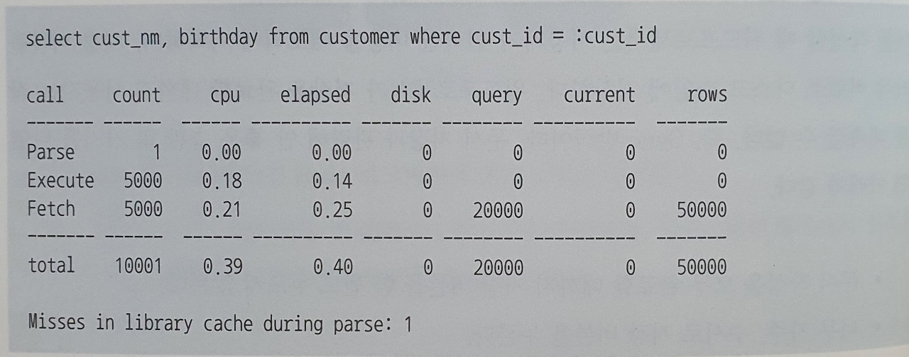
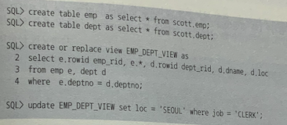
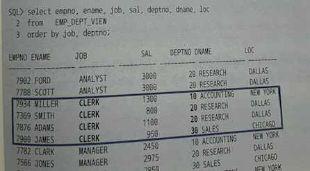

# 6.1 기본 DML 튜닝

- DML 성능 영향 미치는 요소
  - 인덱스
  - 무결성 제약
  - 조건절
  - 서브쿼리
  - Redo 로깅
  - Undo 로깅
  - Lock
  - 커밋


### 인덱스와 DML 성능

- 테이블에 레코드 입력하면? 당연히 인덱스에도 입력해야지!
  테이블은 Freelist 를 통해 입력할 블록을 할당받지만, 인덱스는 정렬된 자료구조이므로 **수직적 탐색을 통해 입력할 블록을 찾아야 한다.** 
  -> 당연히 DML 성능에 미치는 영향도 크다!

  - > Freelist?
    > 테이블마다 데이터 입력이 가능한 블록 목록을 관리하는데, 이를 Freelist 라고 한다.

- delete 도 마찬가지!

- update 할 때는 변경될 컬럼 참조하는 인덱스만 찾아서 변경하면 되는데, 
  정렬 때문에 한 건 변경 시 2개의 오퍼레이션 발생!

  -> 해당 인덱스 레코드 삭제 후 삽입하는 방식으로 처리!


인덱스 개수는 DML 성능에 매우 큰 영향을 끼친다. 따라서 설계에 심혈을 기울여야 한다!

실제 레코드를 가지고 테스트를 해보면 인덱스의 영향이 매우 크다!

| 구분                       | pk 인덱스만 존재 | pk 인덱스 외 2개의 인덱스 |
| -------------------------- | ---------------- | ------------------------- |
| 레코드 100만개 입력시 시간 | 4.95             | 38.98                     |

거의 8배가 차이날 정도로 인덱스는 영향이 크다!


### 무결성 제약과 DML 성능

- 무결성 규칙
  - 개체 무결성
  - 참조 무결성
  - 도메인 무결성
  - 사용자 정의 무결성 (또는 업무 무결성)

**PK,FK 제약은 Check, Not null 제약보다 성능에 더 큰 영향..!**

위에서 테스트 했던 조건 동일하게 보면

| PK/제약 인덱스 | 일반 인덱스(2개) | 소요 시간 |
| -------------- | ---------------- | --------- |
| O              | O                | 38.98     |
| O              | X                | 4.95      |
| X              | X                | 1.32      |


### 조건절과 DML 성능

```sql
update emt set sal = sal * 1.1 where deptno = 40;

delete from emp where deptno = 40;
```

이런 쿼리 실행계획을 보면 select 문과 실행계획이 크게 다르지 않다 -> DML에도 인덱스 튜닝 원리 그대로 적용 가능하다!


### 서브쿼리와 DML 성능

```sql
update emp e set sal = sal * 1.1 
where exists (select 'x' from dept where deptno = e.deptno and loc = "CHICAGO");
```

이또한 실행계획이 select 과 크게 다르지 않으므로 **서브쿼리 조인 튜닝과 같은 원리!**


### Redo 로깅과 DML 성능

오라클은 데이터 파일과 컨트롤 파일에 가해지는 모든 변경사항을 Redo 로그에 기록한다.

-> Redo 로그 : 트랜잭션 데이터가 유실됐을 때 트랜잭션을 재현함으로써 유실 이전 상태로 복구하는 데 사용된다

DML 을 수행할 때마다 Redo 로그를 생성해야하므로 Redo 로그는 성능에 영향을 미친다!
따라서 INSERT 작업을 할 때는 Redo 로깅 생략 기능을 제공한다.

### Undo 로깅과 DML 성능

과거의 rollback == undo(오라클)

Undo 에는 변경된 블록을 이전 상태로 되돌리는데 필요한 정보를 로깅한다.

DML 수행할 때마다 Undo를 생성해야 하므로 성능에 영향을 미칠 수 있다.


### Lock 과 DML 성능

Lock 은 DML 성능에 크고 직접적인 영향을 미친다.

Lock 을 필요이상으로 자주, 길게 사용하거나 레벨(트랜잭션 수준)을 높일수록 DML 성능은 느려진다.
그렇다고 Lock을 너무 적게, 짧게 사용하거나 필요한 레벨 이하로 낮추면 데이터 품질이 나빠진다. 

성능과 데이터 품질은 서로 Trade-Off

**이를 위해 세심한 동시성 제어가 필요하다!**

- 동시성 제어
  - 동시에 실행되는 트랜잭션 수를 최대화하면서 무결성을 유지하기 위해 노력하는 것


### 커밋과 DML 성능

커밋은 DML과 별개로 실행하지만 어쨌든 DML 을 끝내려면 커밋까지 해야하므로 연관되어 있다.

DML 이 락에 의해 블로킹된 경우, DML 이 락을 푸는 열쇠가 커밋이다! 
4절에서 보자.

모든 DBMS 가 FAST Commit 을 지원하고 있다. -> 갱신한 데이터가 아무리 많아도 커밋만큼은 빠르게 처리한다.

단, 커밋은 가벼운 작업은 아니다. 내부 메커니즘 통해서 알아보자.

### (1) DB 버퍼캐시

- DB 에 접속한 사용자를 대신해 모든 일을 처리하는 서버 프로세스는 **버퍼 캐시를 통해 데이터를 읽고 쓴다.**
- 버퍼 캐시에 변경된 블록(dirty 블록)을 모아 주기적으로 데이터 파일에 일괄 기록하는 작업은 DBWR(Database Writer)가 한다.
- 일을 건건이 처리않고 배치 방식으로 한다.


### (2) Redo 로그 버퍼

- 버퍼 캐시는 휘발성이므로 DBWR 프로세스가 더티 블록들을 데이터 반영할 때까지 불안한 상태
  - 하지만, 버퍼캐시에 가한 변경사항은 Redo 로그에도 있으므로 복구 가능!
  - 그런데, Redo 로그도 파일! -> 디스크 IO 발생
    - 오라클은 이를 해결하기 위해 Redo 로그 파일에 기록하기 전 먼저 로그 버퍼에 기록하는 방식!
    - 로그 버퍼에 기록한 내용은 나중에 LGWR(Log Writer)프로세스가 Redo 로그 파일에 일괄(배치) 기록


### (3) 트랜잭션 데이터 저장 과정

한 트랜잭션이 데이터를 변경, 커밋, 변경된 블록을 데이터 파일에 기록하는과정

1. DML 문을 실행하면 Redo 로그버퍼에 변경사항을 기록
2. 버퍼 블록에서 데이터를 변경한다. 
   버퍼 캐시에서 찾지 못하면 데이터 파일을 읽는 작업을 한다. 
3. 커밋
4. LGWR 프로세스가 Redo 로그 버퍼 내용을 로그파일에 일괄저장
5. DBWR 프로세스가 변경된 버퍼 블록들은 데이터 파일에 일괄 저장

**오라클은 데이터를 변경하기 전 로그부터 기록한다.**
서버 프로세스가 버퍼 블록에서 **데이터를 변경하기 전에 Redo 로그 버퍼에 로그를 먼저 기록하는 이유!**


### (4) 커밋 = 저장버튼


## 6.1.2 데이터베이스 Call 과 성능

### 데이터베이스 Call

SQL 트레이스 Call 통계를 보면 SQL 은 3단계로 나눠진다.



- Parse call
  - sql 파싱과 최적화를 수행하는 단계. SQL과 실행계획을 라이브러리 캐시에서 찾으면 최적화 단계는 생략할 수 있다.
- execute call
  - SQL 실행하는 단계. DML 은 이 단계에서 끝나지만 select 문은 fetch 단계도 필요
- fetch call
  - 데이터를 읽어서 사용자에게 결과집합을 전송하는 과정. 전송할 데이터가 많으면 fetch call도 여러번 발생 가능


Call 이 어디서 발생하느냐에 따라 User call 과 Recursive call 로 나눌 수 있다.

- User call 
  - **네트워크를 경유**해 DBMS 외부로부터 인입되는 Call
  - DBMS 입장에서 사용자는 WAS
  - 3-tier 아키텍처에서 user call 은 was 서버에서 발생하는 call
- Recursive call
  - DBMS 내부에서 발생하는 Call
  - SQL 파싱과 최적화 과정에서 발생하는 데이터 딕셔너리 조회, PL/SQL 로 작성한 사용자 정의 함수, 프로시저, 트리거에 내장된 SQL 실행 시 발생하는 call

-> call 이 많으면 당연히 느림 


### 절차적 루프 처리

실제 user call 테스트 시 엄청 느려진다...


### One SQL 중요성

`insert into select` 구문을 보자!

```sql
insert into target select * from source;
```

단 한 번의 call로 처리하면? 위 절차적 루프 처리의 쿼리보다 훨씬 빠르게 처리가 가능했다!


## 6.1.3 Array Processing 활용

물론 실무에서 절차적 프로그램을 one sql 로 처리하기 어려움! 비즈니스 로직 포함하기 때문!

이 때 Array Processing 기능을 활용하면 one sql 을 구현하지 않고도 call 부하를 줄일 수 있다.

*세부 내용은 책 414 ~ 417 참고*


내용은 만번에 1번 씩 insert 를 줄이기에 array proccessing 을 활용하여 one sql 에 준하는 성능 효과를 얻을 수 있다.


## 6.1.4 인덱스 및 제약 해제를 통한 대량 DML 튜닝

동시 트랜잭션 없이 대량 데이터를 적재하는 배치 프로그램에선 인덱스와 무결성 제약조건을 해제해서 성능 개선 효과를 얻을 수 있다!

- PK 제약에 unique 인덱스 사용한 경우
  - 데이터 입력 시간 + 인덱스 재생성, 제약 활성화 해도 기존 시간보다 훨씬 빠름!
  - 무결성에 확신이 없다면 삽입 이후 확인해봐야 함!

- PK 제약에 non-unique 인덱스를 사용한 경우
  - 동일하게 작업 마친 이후 인덱스 재생성하고 PK 제약을 다시 활성화한다.

2가지 경우가 있는데, 어쨌든 매우 빠름!


## 6.1.5 수정가능 조인 뷰

### 전통적인 방식의 UPDATE

```sql
update 고객 c
set 최종 거래 일시 = (select max(거래일시) from 거래 
                -- ....
               ),
    최근 거래횟수 = (select count(*) 
              -- ...
              ),
    최근거래금액 = (select sum(거래금액)
              -- ....
    )
where exists (select 'x' from 거래 
             -- ...
             )
```

위 업데이트를 아래처럼 고칠 수 있다.

```sql
update 고객 c
set (최종거래일시, 최근거래횟수, 최근거래금액) = (select max(거래일시), count(*), sum(거래금액)
                               -- ...
                               )
where exists (select 'x' from 거래 
             -- ...
             )
```

서브쿼리를 줄였지만, 비효율이 어느 정도 있게 된다. 총 고객 수와 한달 이내 거래 고객 수에 따라 성능이 좌우된다.

***전체 레코드가 많다면 exists 서브쿼리를 활용해서 해시 세미 조인으로 유도하는 것을 고려하자***

```sql
update 고객 c
set (최종거래일시, 최근거래횟수, 최근거래금액) = (select max(거래일시), count(*), sum(거래금액)
                               -- ...
                               )
where exists (select /* unnest hash_sj */ 'x' from 거래 
             -- ...
             )
```

만약 한 달 이내 거래를 발생시킨 고객이 많아 update 발생량이 많다면 위로 해결이 불가능하다.

즉, 다른 테이블과 조인이 필요할 때 전통적인 update 문으로는 비효율 완전한 해결이 어렵다.


### 수정가능 조인 뷰

수정가능 조인 뷰를 활용하면 참조 테이블과 두 번 조인하는 비효율을 없앨 수 있다.

조인 뷰 : FROM 절에 두 개 이상의 테이블을 가진 뷰

수정 가능 조인 뷰 : 입력, 수정, 삭제가 허용되는 조인 뷰



위처럼 생성한 조인 뷰를 통해서 update 를 허용하면 원하지 않는 결과가 나오기도 한다.



다른 job 을 가진 사원의 부서 소재지까지 바뀔 수 있다.

따라서 PK 제약을 설정해야할텐데, 
이를 키 보존 테이블이라한다.


### 키 보존 테이블

- 키 보존 테이블 
  - : 조인된 결과 집합을 통해서도 중복 값 없이 유니크하게 식별이 가능한 테이블
  - 단적으로 뷰에 rowid 를 제공하는 테이블이라고 할 수 있다.
    - 실제 select 할 때 ROWID 를 출력할 수 있다.


### ORA-01779 오류 회피


## 6.1.6 MERGE 문 활용

DW  에서 가장 흔히 발생하는 오퍼레이션은 기간계 시스템에서 가져온 신규 트랜잭션 데이터를 반영함으로써 두 시스템 간 데이터를 동기화하는 것

고객 테이블에 발생한 변경분 데이터를 DW에 반영하는 프로세스는 다음과 같다.

1. 전일 발생한 변경 데이터를 DW 시스템으로부터 추출

   ```sql
   create table customer_delta
   as 
   select * from customer 
   -- ....
   ```

2. `customer_delta` 테이블을 DW 시스템으로 전송

3. DW 시스템으로 적재

merge 문은 left outer 방식으로 조인해서 조인에 성공하면 update, 실패하면 insert !


> 일부 생략

### Merge into 활용 예

저장하려는 레코드가 기존에 있던 것이라면 update, 아니면 insert

**-> sql 이 1번만 수행!**


