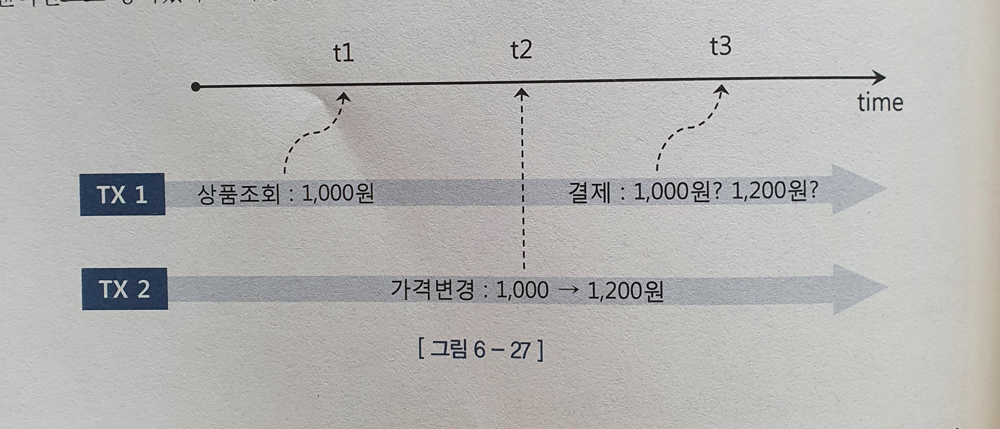

# 6.4 Lock 과 트랜잭션 동시성 제어

Lock 은 DB 의 특징을 결정짓는 가장 핵심적인 메커니즘


## 6.4.1 오라클 Lock

오라클은 공유 리소스와 사용자 데이터를 보호할 목적으로 
DML Lock, DDL Lock, 래치, 버퍼 Lock, 라이브러리 캐시 Lock/Pin 등 다양한 종류의 Lock을 사용한다.

- 래치
  - SGA 공유된 각종 자료구조 보호
- 버퍼 락
  - 버퍼 블록에 대한 액세스 직렬화 하기 위함
- 라이브러리 캐시 락 & pin
  - 라이브러리 캐시에 공유된 sql 커서와 pl/sql 프로그램을 보호하기 위해 사용


- 무엇보다 중요하게 다뤄야 할 Lock 은 **DML Lock**
  - 다중 트랜잭션이 동시에 액세스하는 사용자 데이터의 무결성을 보호해준다.
  - 테이블 lock 과 row lock 이 존재


### DML 로우 Lock

DML 로우 Lock : 두 개의 동시 트랜잭션이 같은 로우를 변경하는 것을 방지. 
하나의 로우를 변경하려면 로우 lock 을 먼저 설정해야 한다.

- 어떤 DBMS 든지 DML 로우 Lock 에는 배타적 모드를 사용 -> update or delete 를 진행중인 로우(커밋 이전의 로우)를 다른 트랜잭션이 update나 delete 할 수 없다.

- **insert에 대한 row lock 경합은 unique 인덱스 있을 때만 발생**

  - unique 인덱스가 있는 상황에서 두 트랜잭션 경합 -> 블로킹 발생
    - 후행 트랜잭션은 기다렸다가 선행 트랜잭션이 커밋하면 insert 실패, 선행이 롤백하면 후행이 성공!
  - 서로 다른 값을 입력하거나, unique 인덱스가 없으면 insert 에 대한 로우 lock 경합은 발생하지 않는다.

- MVCC 모델을 사용하는 **오라클**은 다른 트랜잭션이 변경한 로우를 읽을 때, 
  **복사본 블록을 만들어서 쿼리가 시작된 시점으로 되돌려서 읽는다.**

  - 따라서 select 절에 lock 을 사용할 필요가 없다.

  - > Non-repeatable read 같은 문제가 발생하지 않는다는 뜻으로 이해해도 되겠지?

    - 참고로 MVCC 모델을 사용하지 않는 DBMS 는 select 문에 공유 lock 을 사용한다.
    - 공유 lock 끼리는 호환되며 두 트랜잭션이 같이 락을 설정할 수 있음! 대신 서로 진행을 방해할 수도 있음.
      - 다른 트랜잭션이 읽고 있는 로우를 변경하려면 다음 레코드 이동할 때까지 기다려야 하며, 커밋을 기다리기도...


DML 로우 Lock 에 의한 성능 저하를 방지하려면 lock 을 오래 유지하지 않기 위해 커밋 시점을 조절해야한다.

> **MVCC 모델?**
>
> 다중버전 동시성 제어(Multiversion Concurrency Control, 이하 MVCC) 메커니즘
>
> - 데이터를 변경할 때마다 그 변경사항을 Undo 영역에 저장해 둔다
> - 데이터를 읽다가 쿼리(또는 트랜잭션) 시작 시점 이후에 변경된(변경이 진행 중이거나 이미 커밋된) 값을 발견하면, Undo 영역에 저장된 정보를 이용해 쿼리(또는 트랜잭션) 시작 시점의 일관성 있는 버전(CR Copy)을 생성하고 그것을 읽는다.
>
> https://dataonair.or.kr/db-tech-reference/d-guide/sql/?mod=document&uid=363

### DML 테이블 Lock

오라클은 DML 로우 lock 을 설정하기 전에 테이블 lock(*TM lock이라고도 함*) 을 먼저 설정한다.
현재 트랜잭션이 갱신중인 테이블 구조를 다른 트랜잭션이 변경하지 못하게 막기 위해서!

오라클은 로우 lock에 항상 배타적 모드를 사용하지만, 테이블 lock은 여러 lock모드를 사용한다.

- RS: row share
- RX: row exclusive
- S: Share
- SRX: share row exclusive
- X: exclusive

테이블 lock 이라고 하면 테이블 전체에 lock이 걸린다고 생각하기 쉬운데 그렇게 이해하는 것이 아니다.
DML 쑤행하기 전에 항상 테이블 lock을 먼저 설정하기에 잘못 이해한 것!
하나의 로우를 변경하기 위해 테이블 전체에 lock을 건다면 동시성이 좋은 애플리케이션을 구현하기 어렵다.


- 오라클이 말하는 테이블 lock

  - 자신이 해당 테이블에서 현재 어떤 작업을 수행중인지 알리는 푯말
  - 테이블 lock에는 여러 모드가 있고, 어떤 모드인지에 따라 후행 트랜잭션이 수행할 수 있는 작업의 범위가 달라진다!
    - 진행할지, 기다릴지, 작업을 포기할지...

  - EX) DDL 이용해 테이블 구조를 변경하려는 트랜잭션은 해당 테이블에 테이블 lock이 걸려있는지 먼저 확인한다.
    - 테이블 lock을 RX 모드로 설정한 트랜잭션이 하나라도 있으면, 현재 테이블 갱신중인 트랜잭션이 있다는 신호
      - 작업을 멈추고 기다린다.
    - DDL 문에 먼저 수행중일 때는 DML 트랜잭션이 기다리겠지!


### lock을 푸는 열쇠, 커밋

**블로킹과 교착상태**

- 블로킹
  - 선행 트랜잭션이 설정한 lock 때문에 후행 트랜잭션이 작업을 진행하지 못하고 멈춘 상태
    - 해소  방법: 커밋 or 롤백

- 교착상태(deadlock)
  - 두 트랜잭션이 각각 특정 리소스에 lock을 설정한 상태에서 맞은편 트랜잭션의 리소스에 lock을 설정하려고 진행하는 상황
    - 오라클의 교착상태에선, 문장 수준의 롤백을 진행하고 교착상태 발생시킨 문장을 롤백한다.
    - 교착 상태가 해소된 이후 블로킹 상태에 놓이는데, 이 때 커밋할지 롤백할지 결정
      - 예외 처리(커밋 or 롤백)를 하지 않으면 대기 상태를 지속하게 된다.


**오라클의 lock 경합**

- 오라클은 읽을 때 lock을 사용하지 않으므로 lock 경합이 적게 발생하며,
  읽는 트랜잭션 진행 막는 부담도 없어서 트랜잭션 길게 가져갈 수 있다!
- 단, 불필요하게 길면 롤백 시 부담...
  - undo 세그먼트가 너무 길어질 수도...
- 적절한 시점에 커밋하자.
  - 물론 너무 커밋 많으면, 서버 프로세스가 LGWR 에게 로그 버퍼를 비우도록 요청하고, 동기 방식으로 기다리는 횟수가 늘기 때문에 기본적으로 성능이 느려진다.
  - 잦은 커밋 때문에 성능이 매우 느리다면, 비동기식 커밋과 배치 커밋을 활용할 수도 있다.
    - WAIT : LGWR가 로그 버퍼를 파일에 기록했다는 완료 메시지 받을 때까지 기다린다
    - NOWAIT : LGWR의 완료 메시지를 기다리지 않고 바로 다음 트랜잭션 진행
    - IMMEDIATE : 커밋 명령 받을 때마다 LGWR가 로그 버퍼를 파일에 기록
    - BATCH : 세션 내부에 트랜잭션 데이터 일정량 버퍼링 했다가, 일괄 처리


## 6.4.2 트랜잭션 동시성 제어

- 비관적 동시성 제어

  - 사용자들이 같은 데이터를 동시에 수정한다고 가정

    - 한 사용자가 데이터를 읽는 시점에 lock을 걸고, 조회 또는 갱신될 때까지 이를 유지

    - 잘못 사용하면 동시성이 나빠진다.

      

- 낙관적 동시성 제어

  - 같은 데이터를 동시에 수정하지 않는다고 가정
    - lock을 설정하지 않는다.
      - 물론 그렇다고 동시 트랜잭션에 의한 잘못된 데이터 갱신을 신경쓰지 않아도 되는건 아님!
      - 읽는 시점에 lock을 쓰진 않았지만, 앞에서 읽은 데이터가 변경되었는지 검사해야함


### 비관적 동시성 제어

```sql
select * 
from 고객
where 고객번호 = :cust_num

-- 새로운 적립 포인트 개산
update 고객 set 적립포인트 = :적립포인트 
where 고객번호 = :cust_num
```

이렇게 하면, 다른 트랜잭션이 같은 고객의 실적 정보를 변경한다면 문제가 생길 수 있다!

select for update 를 사용해보자.

```sql
select * 
from 고객
where 고객번호 = :cust_num
for update;
```

비관적 동시성 제어는 잘못 갱신되는 문제를 방지할 수 있지만, 
`for update` 에 wait 이나 nowait 옵션을 함께 사용하면 lock 을 얻기 위해 무한정 기다리지 않아도 된다!

```sql
for update nowait 
-- 대기 없이 exception
for update wait 3
-- 3초 대기 후 exception 던짐
```

이렇게 하면 다른 사용자에 의해 변경 중임을 알 수 있어서 트랜잭션을 종료, 오히려 동시성 증가!

> for update 락 해제 시점은 동일 세션에서 transaction을 해제(commit등) 을 하기 전까지!


### 큐 테이블 동시성 제어

큐 테이블에 쌓인 고객 입금 정보를 일정한 시간 간격으로 읽어서 입금 테이블에 반영하는 데몬 프로그램이 있다고 가정.
데몬 여러개 -> Lock 이 걸릴 수 있다.

Lock이 걸리면 3초간 대기 후 다시 시도하기 위해 `wait 3` 지정.
큐에 쌓인 데이터를 한 번에 다 읽어서 처리하면 lock 이 풀릴 때까지 다른 데몬이 오래 걸릴 수 있으므로 고객정보를 100개씩만 읽도록 처리!

```sql
select * 
form cust
where ~~
and rownum <= 100 for update wait 3;
```

추가로, `skip locked` 옵션을 사용하면 lock 이 걸린 레코드는 생략하고 다음 레코드를 계속 읽도록 구현할 수 있다. 
(이 때는 rownum 조건을 제거하고, 클라이언트 단에서 100개를 읽으면 멈추도록 구현해야 한다. 한건씩 fetch 하지말고 100개 단위로 array 처리)

```sql
select * 
form cust
where ~~
for update skip locked;
-- rownum 조건 없음
```


### 낙관적 동시성 제어

select-list 에서 4개 컬럼을 참조했을 때 낙관적 동시성 제어의 예시를 보자.

```sql
select 적립포인트, 방문횟수, 최근방문일시, 구매실적 into :a, :b, :c, :d
from 고객
where 고객번호 = :cust_num

-- 적립 포인트 계산

update 고객 set 적립포인트 = :적립포인트
where 고객번호 = :cust_num
and 적립포인트 = :a
and 방문횟수 = :b
-- ~~...

if sql%rowcount = 0 then
	alert("다른 사용자에 의해 변경되었습니다.")
end if;
```

select 문에서 읽은 컬럼이 많으면 일일이 기술하는 것이 매우 귀찮... updated_at 같은 컬럼으로 확인하자!

```sql
select 적립포인트, 방문횟수, 최근방문일시, 구매실적, 변경일시 into :a, :b, :c, :d, :updated_at
from 고객
where 고객번호 = :cust_num

-- 적립 포인트 계산

update 고객 set 적립포인트 = :적립포인트, 변경일시 = sysdate
where 고객번호 = :cust_num
and 변경일시 = :updated_at;

if sql%rowcount = 0 then
	alert("다른 사용자에 의해 변경되었습니다.")
end if;
```

낙관적 동시성 제어도 update 전에 아래 select 문을 한 번 더 수행함으로써 lock 에 대한 예외 처리를 한다면, 
다른 트랜잭션이 설정한 Lock 을 기다리지 않게 구현할 수 있다.

```sql
select 고객번호
from 고객
where 고객번호 = :cust_num
and 변경일시 = :updated_at
for update nowait;
```


### 동시성 제어 없는 낙관적 프로그래밍

- 낙관적 동시성 제어 사용 -> lock이 유지되는 시간이 짧아져 동시성을 높이는 데 매우 유리
  - 하지만, 다른 사용자가 같은 데이터를 변경했는지 검사하고 그에 따라 처리 방향성을 결정해야 하는 귀찮은 절차가 뒤따름!

예시를 통해서 동시성 제어가 없이 프로그래밍된 경우를 보자

#### 온라인 쇼핑의 결제



tx1 이 최종 결제 클릭하는 순간 어떻게 해야할까?

- 상품 가격의 변경 여부를 체크함으로써 해당 주문을 취소시키거나, 사용자에게 변경 사실을 알리고 처리 방향을 확인받는 프로세스를 거쳐야 함.
  - 그러나 그런 로직을 찾기 어려움. 주문 진행하는 동안 가격 변동 없을거라고 낙관적으로 생각하기 때문!


### 데이터 품질과 동시성 향상을 위한 제언

성능보다 데이터 품질이 더 중요하다! for update 의 사용을 두려워하지 말자.

다중 트랜잭셩니 존재하는 데이터베이스 환경에서 공유 자원에 대한 액세스 직렬화는 필수!

**for update 를 정확히 사용하고, 동시성이 나빠지지 않게 wait 또는 nowait 옵션을 활용**한 예외처리에 세심한 주의를 기울여야 한다.

- 불필요하게 lock 을 오래 유지하지 않고, 트랜잭션의 원자성을 보장하는 범위 내에서 커밋하기!
- 낙관적 + 비관적 동시성 제어 같이 사용
  - 낙관적 먼저 시도, 이후 변경된 기록 있으면 이후는 비관적 시도
- SQL 튜닝은 필수
  - 락에 대한 고민은 트랜잭션내 쿼리 튜닝 끝낸 이후에 해도 괜찮다.


## 6.4.3 채번 방식에 따른 insert 성능 비교

insert, update, delete, merge 중에서 가장 중요하고 튜닝 요소 많은 것은 insert!
채번(번호 부여) 방식에 따른 성능 차이가 매우 크기 때문

**채번 방식**

- 채번 테이블
- 시퀀스 오브젝트
- MAX + 1 조회


### 채번 테이블

각 테이블의 식별자의 단일 컬럼 일련번호 또는 구분 속성별 채번하기 위해 별도 테이블을 관리

- 채번 레코드를 읽어서 1을 더한 값으로 변경, 그 값을 새 레코드로 입력
- 채번 레코드 변경 과정에서 액세스 직렬화 이뤄지므로 중복 값 채번 가능성 없음

**장점**

- 범용성 좋음
- insert 과정에 중복 예외 처리 안해도 된다.
- inser 과정 결번 방지
- pk가 복합키여도 가능

**단점**

- 성능이 안좋음
  - 변경을 위한 로우 lock 경합 발생하기 때문
  - 로우 락은 기본적으로 대상 테이블에 insert 마치고, 커밋 혹은 롤백할 때까지 지속
  - 동시 insert가 많으면 채번 레코드 뿐만 아니라, 채번 테이블 블록 자체에도 경합 발생
    - 서로 다른 레코드 변경하는 프로세스끼리도 경합 발생 가능..!

### 시퀀스 오브젝트

장점

- 성능이 빠름
- 중복 레코드 발생 예외처리 안해도 됨
- 테이블 별 시퀀스 오브젝트 생성, 관리 하는 부담은 있지만 사용하기 매우 편리

단점

- 성능이슈가 없는것은 아니다. 시퀀스 채번 과정에서 발생하는 Lock 이 있다.
  - **시퀀스 오브젝트는 오라클 내부에서 관리하는 채번 테이블이다!**
  - 시퀀스 오브젝트도 결국 테이블이므로 값을 읽고 변경하는 과정에 lock 메커니즘이 작동한다.
  - 시퀀스 lock 에 의한 성능 이슈가 있지만, 캐시 사이즈를 적절히 설정하면 가장 빠름

- PK가 단일 컬럼일 때만 사용 가능
- 신규 데이터 입력하는 과정에서 결번 생길 수 있다.
  - 시퀀스 채번 이후 트랜잭션을 롤백하는 이유
  - 캐시 옵션을 설정한 시퀀스가 캐시에서 밀려나는 경우

일련번호에 결번이 생기는 현상을 막을 필요는 없긴 하다!


### MAX + 1 조회

최종 일련 번호를 조회하고 거기에 1을 더해서 insert 하는 방식

**장점**

- 시퀀스 또는 별도의 채번 테이블을 관리하는 부담 없음
- 동시 트랜잭션 의한 충돌이 많지 않으면 성능이 매우 빠르다
- PK가 복합 컬럼인 경우에도 사용 가능
  - 구분 속성 값의 수가 아무리 많아도 상관없고, 값의 수가 많을수록 성능 좋아진다.

**단점**

- 레코드 중복에 대비한 세밀한 예외 처리
- 다중 트랜잭션의한 동시 채번 심하면 시퀀스보다 성능이 많이 나빠질 수 있다.
  - 레코드 중복에 의한 로우 lock 경합 때문


> Oracle 에서는 MySql에 있는 Auto_Increment 기능이 없다.
>
> 그렇기에 자동으로 인덱스값을 증가시켜주기 위해서는 시퀀스를 생성해서 사용해야한다.

