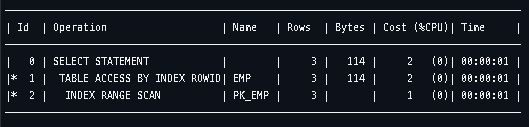

# 1.1 SQL 파싱과 최적화

SQL 튜닝을 하기 전 옵티마이저가 SQL을 어떻게 처리하는지, 서버 프로세스는 데이터를 어떻게 읽고 저장하는지 살펴봅시다.


## 1.1.1 구조적, 집합적, 선언적 질의 언어

SQL은 Structed Query Language의 줄임말입니다.

오라클 PL/SQL, SQL Server T-SQL처럼 절차적 프로그래밍 기능을 구현할 수 있는 확장 언어도 제공하지만, SQL은 기본적으로 구조적(structured)이고 집합적(set-based)이고 선언적(declarative)인 질의 언어입니다.

원하는 결과집합을 구조적, 집합적으로 선언하지만 그 결과집합을 만드는 과정은 절차적일 수 밖에 없습니다.

즉, 프로시저가 필요한데, 그런 프로시저를 만들어 내는 DBMS 내부 엔진이 바로 SQL 옵티마이저입니다.


## 1.1.2 SQL 최적화

SQL을 실행하기 전 최적화 과정을 세분화하면 아래와 같습니다.

### SQL 파싱

사용자로부터 SQL을 전달받으면 SQL Parser가 파싱을 진행합니다.

* 파싱 트리 생성 : SQL문을 이루는 개별 구성요소를 분석해서 파싱 트리 생성
* Syntax 체크 : 문법적 오류가 없는지 확인
* Semantic 체크 : 의미상 오류가 없는지 확인(존재하지 않는 테이블 or 칼럼, 권한)

### SQL 최적화

옵티마이저가 이 역할을 맡습니다.

SQL 옵티마이저는 미리 수집한 시스템 및 오브젝트 통계정보를 바탕으로 다양한 실행경로를 생성해서 비교한 후 가장 효율적인 하나를 선택합니다.

데이터베이스 성능을 결정하는 가장 핵심적인 엔진입니다.

### 로우 소스 생성

SQL 옵티마이저가 선택한 실행경로를 실제 실행 가능한 코드 또는 프로시저 형태로 포맷팅하는 단계입니다.

로우 소스 생성기가 그 역할을 맡습니다.


## 1.1.3 SQL 옵티마이저

SQL 옵티마이저는 사용자가 원하는 작업을 가장 효율적으로 수행할 수 있는 최적의 데이터 엑세스 경로를 선택해주는 DBMS 핵심 엔진입니다.

최적화 단계는 아래와 같습니다.

1. 사용자로부터 전달받은 쿼리를 수행하는데 후보군이 될만한 실행계획들을 찾아냅니다.
2. 데이터 딕셔너리에 미리 수집해 둔 오브젝트 통계 및 시스템 통계정보를 이용해 각 실행계획의 예상비용을 산정합니다.
3. 최저 비용을 나타내는 실행계획을 선택합니다.


## 1.1.4 실행계획과 비용

DBMS에는 SQL 실행을 미리 볼 수 있는 기능이 있습니다.

이를 **실행계획(Execution Plan)** 이라고 합니다.




이를 통해 SQL이 테이블 스캔을 하는지, 인덱스 스캔을 하는지, 어떤 인덱스에 대해서 스캔을 하는지 확인할 수 있습니다.

이 때 옵티마이저는 full scan, 여러 종류의 idex scan 등의 Cost를 미리 계산하여 최적을 선택합니다.

하지만 SQL 실행계획에 표시되는 Cost는 예상치입니다. 

실제 수행할 때 발생하는 I/O 또는 시간과 많은 차이가 있습니다.


## 1.1.5 옵티마이저 힌트

통계정보에 담을 수 없을 수 없는 데이터 또는 업무 특성을 활용해 개발자가 옵티마이저보다 더 효율적인 엑세스를 찾을 수 있습니다. 이 때 옵티마이저 힌트를 이용해 데이터 엑세스 경로를 바꿀 수 있습니다.

``` SQL
SELECT /*+ INDEX(A 고객_PK) */
       고객명, 연락처, 주소, 가입일시
  FROM 고객 A
 WHERE 고객 ID = '00001'
```


힌트를 엑세스 방식, 인덱스, 조인 방식과 순서 등 모든 것에 대해서 지정할 수 도 있고, 특정 부분에 대해서만 지정할 수도 있습니다. 

지정이 안된 부분은 옵티마이저가 결정을 하게 됩니다.

옵티마이저의 실수가 기업에 큰 손실을 끼치는 시스템이라면 모든 부분을 옵티마이저에게 맡기지말고 힌트로서 빈틈없이 기술하는게 옳습니다.


### 주의사항

* 힌트와 힌트 사이에는 ,를 사용하면 안됩니다.

  ```SQL
  /*+ INDEX(C), FULL(D) */
  ```

  

* 테이블을 지정할 때 아래와 같이 스키마명까지 명시하면 안됩니다.

  ```SQL
  SELECT /*+ FULL(SCOTT.EMP) */
    FROM EMP
  ```

  

* FROM 절 테이블 명 옆에 ALIAS를 지정했다면 힌트에도 반드시 ALIAS를 사용해야 합니다.

  ```SQL
  SELECT /*+ FULL(EMP) */
    FROM EMP E
  ```


