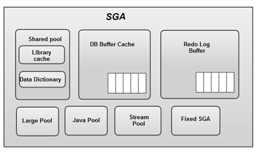

# 1.2 SQL 공유 및 재사용

소프트 파싱과 하드 파싱의 차이점을 이해해봅시다.

SQL의 내부 최적화 과정의 복잡성을 알고 나면 동시성이 높은 온라인 트랜잭션 처리 시스템에서 바인드 변수가 왜 중요한지 알 수 있습니다.


## 1.2.1 소프트 파싱 VS 하드 파싱

SQL 파싱, 최적화, 로우 소스 생성 과정을 거쳐 생성한 내부 프로시져를 반복 재사용할 수 있도록 캐싱해두는 메모리 공간을 **라이브러리 캐시**라고 합니다.

라이브러리 캐시는 SGA 구성요소입니다.

SGA는 System Global Area의 줄임말로 서버 프로세스와 백그라운드 프로세스가 공통으로 엑세스하는 데이터와 제어 구조를 캐싱하는 메모리 공간입니다.



사용자가 SQL문을 전달하면 DBMS는 SQL을 파싱한 후 해당 SQL이 라이브러리 캐시에 존재하는지부터 확인합니다.

캐시에서 찾으면 곧바로 실행 단계로 넘어가지만 찾지 못하면 최적화 단계를 거칩니다.

**소프트 파싱** 이란 SQL을 캐시에서 찾아 곧바로 실행단계로 넘어가는 것을 말하고,

**하드 파싱** 이란 캐시에서 찾는데 실패하여 최적화 및 로우 소스 생성 단계까지 모두 거치는 것을 말합니다.


### SQL 최적화 과정은 왜 하드한가

옵티마이저가 SQL을 최적화할 때 사용자가 생각하는 것 보다 훨씬 더 많은 일을 수행합니다.

예를 들어 다섯 개 테이블을 조인하는 쿼리문 하나를 최적화하는데도 5!의 경우의 수가 존재합니다.

옵티마이저가 사용하는 정보는 아래와 같습니다.

* 테이블, 칼럼, 인덱스 구조에 관한 기본 정보
* 오브젝트 통계 : 테이블 통계, 인덱스 통계, 컬럼 통계
* 시스템 통계 : CPU 속도, Single Block I/O 속도, Multiblock I/O 속도 등
* 옵티마이저 관련 파리미터 


이러한 복잡한 작업을 거쳐 생성한 내부 프로시져를 한 번만 사용하고 버린다면 비효율적일 것입니다.

따라서 라이브러리 캐시가 필요합니다.


## 1.2.2 바인드 변수의 중요성

### 이름없는 SQL 문제

사용자 정의 함수/프로시저, 트리거, 패키지 등은 생성할 때부터 이름을 갖습니다. 

컴파일한 상태로 딕셔너리에 저장되며, 사용자가 삭제하지 않는 한 영구적으로 보관됩니다.

실행할 때 라이브러리 캐시에 적재함으로써 여러 사용자가 공유하면서 재사용합니다.


반면에 SQL은 이름이 따로 없고 전체 SQL 텍스트가 이름 역할을 합니다. 

딕셔너리에 저장하지도 않습니다. 다만 라이브러리 캐시에 적재하고 여러 사용자가 공유하면서 재사용합니다.

DBMS가 SQL을 영구 저장하지 않는 이유를 생각해봅시다.

사용자 정의 함수/프로시저는 내용을 수정해도 이름이 변하지 않으므로 같은 프로그램이 무한 생성되지 않습니다.

SQL은 이에 비해 텍스트 중 작은 부분이라도 수정되면 다른 객체가 새로 탄생하는 구조입니다.

SQL은 개발 과정에서 수시로 변경이 일어나고, 일회성 SQL 등 까지 모두 저장하려고 하면 많은 공간이 필요하고 SQL을 찾는 속도도 느려질 것입니다.


### 공유 가능 SQL

라이브러리 캐시에서 SQL을 찾기 위해 사용하는 키 값이 SQL문 텍스트 이므로 아래 두 개는 다른 SQL 입니다.

``` SQL
SELECT * FROM EMP WHERE EMPNO = 7900;
select * from emp where empno = 7900;
```


아래 두 개의 프로그램을 비교해봅시다.

```java
// case1
public void login(String login_id) throws Exception {
  String SQLStmt = "SELECT * FROM CUSTOMER WHERE LOGIN_ID = '" + login_id + "'";  
  // 이하 생략
}


// case2
public void login(String login_id) throws Exception {
  String SQLStmt = "SELECT * FROM CUSTOMER WHERE LOGIN_ID = ?";  
  // 이하 생략
}
```


많은 로그인 요청이 들어온다고 가정을 해봅시다.

case1 같은 경우, 라이브러리 캐시가 해당 쿼리로 가득하게 될 것입니다.

하지만 case2의 경우에는 아래와 같이 하나의 SQL만 저장하고 이를 공유해서 사용합니다.

```sql
SELECT * FROM CUSTOMER WHERE LOGIN_ID = :1
```


