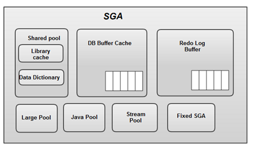

# 1.3 데이터 저장 구조 및 I/O 매커니즘

SQL 튜닝의 원리를 제대로 이해하려면 I/O에 대한 이해가 중요합니다.

데이터 저장 구조 ,디스크 및 메모리에서 데이터를 읽는 메커니즘을 차례로 살펴봅시다.


## 1.3.1 SQL이 느린 이유

SQL이 느린 이유는 디스크 I/O 때문입니다.

interrupt 없이 열심히 일하던 프로세스도 디스크에서 데이터를 읽어야 할 땐 CPU를 OS에 반환하고 I/O가 완료되기를 기다립니다.

이렇게 기다리는 과정이 발생하므로 I/O가 많으면 성능이 느릴 수 밖에 없습니다.


## 1.3.2 데이터베이스 저장 구조

데이터를 저장하려면 먼저 테이블스페이스를 생성해야 합니다.

테이블스페이스는 세그먼트를 담는 콘테이너로서, 여러 개의 데이터파일(디스크 상의 물리적인 OS 파일)로 구성됩니다.


* 블록 : 데이터를 읽고 쓰는 단위
* 익스텐트 : 공간을 확장하는 단위. 연속된 블록 집합
* 세그먼트 : 데이터 저장공간이 필요한 오브젝트(테이블, 인덱스, 파티션, LOB)
* 테이블스페이스 : 세그먼트를 담는 콘테이너
* 데이터파일 : 디스크 상의 물리적인 OS 파일

테이블스페이스를 생성했으면 위 그림과 같이 세그먼트를 생성합니다.

세그먼트는 테이블, 인덱스처럼 데이터 저장공간이 필요한 오브젝트입니다. 테이블, 인덱스를 생성할 때 데이터를 어떤 테이블스페이스에 저장할지를 지정합니다.

세그먼트는 익스텐트로 구성이 됩니다. 파티션 구조가 아니라면 테이블도 하나의 세그먼트이고, 인덱스도 하나의 세그먼트입니다.

테이블 또는 인덱스가 파티션 구조라면 각 파티션이 하나의 세그먼트가 됩니다.

익스텐션은 공간을 확장하는 단위입니다. 테이블이나 인덱스에 데이터를 입력하다가 공간이 부족해지면 해당 오브젝트가 속한 테이블스페이스로부터 익스텐트를 추가로 할당받습니다.

익스텐션은 여러 개의 데이터 블록으로 구성됩니다.

익스텐션 단위로 공간을 확장하지만 사용자가 입력한 레코드를 실제를 저장하는 공간은 데이터 블록입니다.

한 블록은 하나의 테이블이 독점하게 됩니다. 즉 한 블록에 두 테이블의 데이터가 공존할 수 없습니다.


세그먼트 공간이 부족해지면 테이블스페이스로부터 익스텐트를 추가로 할당받는데, 세그먼트에 할당된 익스텐트가 같은 데이터파일에 위치하지 않을 수 있습니다. 

하나의 테이블스페이스를 여러 데이터파일로 구성하면, 파일 경합을 줄이기 위해 DBMS가 데이터를 가능한 한 여러 데이터파일로 분산해서 저장하기 떄문입니다.


## 1.3.3 블록 단위 I/O

DBMS가 데이터를 읽고 쓰는 단위는 블록입니다.

데이터 I/O 단위가 블록이므로 특정 레코드 하나를 읽고 싶어도 해당 블록을 통째로 읽습니다.

테이블 뿐만 아니라 인덱스도 블록 단위로 데이터를 읽고 씁니다.


## 1.3.4 시퀀셜 엑세스 vs 랜덤 엑세스

테이블 또는 인덱스 블록을 읽는 방식은 `시퀀셜 엑세스` 와 ` 랜덤 엑세스` 두 가지 방식이 있습니다.

### 시퀄셜 엑세스

시퀀셜 엑세스는 논리적, 물리적 연결된 순서에 따라 차례대로 블록을 읽는 방식입니다. 

인덱스 같은 경우에는 리프 블록들이 서로 주소값을 저장하고 있어 논리적으로 순차 접근이 가능합니다.

테이블 같은 경우는 논리적인 연결이 되어있지 않기 때문에 별도의 방법이 필요합니다.

오라클 같은 경우, 세그먼트에 할당된 익스텐트 목록을 세그먼트 헤더에 맵으로 관리합니다. 익스텐트 맵은 각 익스텐트의 첫 번째 블록 주소 값을 갖습니다.

읽어야 할 익스텐트 목록을 맵에서 얻고 연속되어 저장된 블록을 읽으면 이것이 Full Table Scan 입니다.


### 랜덤 엑세스

랜덤 엑세스는 논리적, 물리적인 순서를 따르지 않고, 레코드 하나를 읽기 위해 한 블록씩 접근하는 방식입니다.


## 1.3.5 논리적 I/O vs 물리적 I/O

### DB 버퍼캐시

디스크 I/O가 SQL 성능을 결정하기 때문에 DBMS는 데이터 캐싱 매커니즘이 필수적입니다.



DB 버퍼캐시도 앞에서 살펴봤던 SGA의 중요한 구성요소 중 하나입니다.

라이브러리 캐시가 SQL과 실행계획, DB 저장형 함수/프로시저 등을 캐싱하는 코드 캐시라면 DB 버퍼캐시는 데이터 캐시입니다.


### 논리적 I/O vs 물리적 I/O

#### 논리적 I/O

논리적 블록 I/O는 SQL문을 처리하는 과정에 메모리 버퍼캐시에서 발생한 총 블록 I/O를 말합니다.

SQL이 참조하는 테이블에 데이터를 입력하거나 삭제하지 않는 상황에서 조건절에 같은 변수 값을 입력하면, 아무리 여러 번 실행해도 매번 읽는 블록 수는 같습니다.

SQL을 수행하면서 읽은 총 블록 I/O가 논리적 블록 I/O입니다.


#### 물리적 I/O

물리적 블록 I/O는 디스크에서 발생한 총 블록 I/O를 말합니다.

DB 버퍼캐시에서 블록을 찾지 못해 디스크에서 읽은 블록 I/O가 물리적 I/O입니다.

SQL이 참조하는 테이블에 데이터를 입력하거나 삭제하지 않는 상황에서 조건절에 같은 변수 값을 입력하면,  매번 읽는 블록 수는 다릅니다.


메모리 I/O는 전기적 신호인데 반해, 디스크 I/O는 물리적으로 엑세스 Arm이 동작하므로 약 10000배 정도의 속도 차이가 존재합니다.


### 버퍼캐시 히트율 

버퍼캐시 효율을 측정하는데 가장 많이 사용해 온 지표입니다.

```
BCHR = ( 캐시에서 곧바로 찾은 블록 수 / 총 읽은 블록 수 ) * 100
     = (( 논리적 I/O - 물리적 I/O ) / 논리적 I/O) * 100
     = ( 1 - (물리적 I/O) / (논리적 I/O)) * 100
```

애플리케이션 특성에 따라 다르지만 온라인 트랜잭션을 주로 처리하는 애플리케이션은 99%의 히트율을 달성해야합니다.


```
물리적 I/O = 논리적 I/O * (100 - BCHR)
```

같은 SQL에 대해 논리적 I/O는 항상 일정하므로 물리적 I/O는 BCHR에 의해 결정되고, BCHR는 상황에 따라 달라집니다.

물리적 I/O는 시스템 상황에 의해 결정되는 통제 불가능한 외생변수이므로 SQL 성능을 높이기 위해서 할 수 있는 일은 논리적 I/O를 줄이는 일입니다.

논리적 I/O를 줄이기 위해서는 SQL을 튜닝해서 총 블록 개수를 줄여야 합니다.

논리적  I/O는 항상 같은 일정하게 발생하는 통제 가능한 내생변수입니다.


## 1.3.6 Single Block I/O vs Multiblock I/O

### Single Block I/O 

`Single Block I/O` 는 한 번에 한 블록씩 요청해서 메모리에 적재하는 방식입니다.

데이터를 소량 필요하는 아래와 같은 경우에 사용됩니다.

* 인덱스 루트 블록을 읽을 때
* 인덱스 루트 블록에서 얻은 주소 정보로 브랜치 블록을 읽을 때
* 인덱스 브랜치 블록에서 얻은 주소 정보로 리프 블록을 읽을 때
* 인덱스 리프 블록에서 얻은 주소 정보로 테이블 블록을 읽을 때


### Multiblock I/O

`Multiblock I/O` 은 한 번에 여러 블록씩 요청해서 메모리에 적재하는 방식입니다.

테이블이 클수록 Multiblock I/O 단위도 크면 좋습니다.


## 1.3.7 Table Full Scan vs Index Range Scan

테이블에 저장된 데이터를 읽는 방식은 두 가지입니다. 

`Table Full Scan`은 테이블에 속한 블록 전체를 읽어서 사용자가 원하는 데이터를 찾는 방식입니다.

`Index Range Scan`은 인덱스에서 일정량을 스캔하면서 얻은 ROWID로 테이블 레코드를 찾아가는 방식입니다.


### Index Range Scan이 Table Full Scan보다 느린 경우

Table Full Scan은 `시퀀셜 엑세스`와 `Multiblock I/O` 방식으로 디스크 블록을 읽습니다.

때문에 한 번에 많은 데이터를 가져올 수 있지만, 소량의 데이터를 찾기 위해서 많은 데이터를 스캔하는건 비효율적입니다.

이럴 경우에는 인덱스를 이용해야합니다.


Index Range Scan은 `랜덤 액세스`와 `Single Block I/O` 방식으로 디스크 블록을 읽습니다.

따라서 캐시에서 블록을 못찾으면 레코드 하나를 읽기 위해 프로세스는 대기하게 됩니다.

따라서 많은 데이터를 읽을 때는 Table Full Scan보다 불리합니다. 

또한 읽었던 블록을 반복해서 읽는 비효율도 발생합니다.

한 블록에 평균 500개 레코드가 있으면, 같읕 블록을 최대 500번 읽을 수 있습니다.


## 1.3.8 캐시 탐색 매커니즘

Direct Path I/O를 제외한 모든 블록 I/O는 메모리 버퍼캐시를 경유합니다.

아래 작업들은 모두 버퍼캐시 탐색 과정을 거칩니다.

* 인덱스 루트 블록을 읽을 때
* 인덱스 루트 블록에서 얻은 주소 정보로 브랜치 블록을 읽을 때
* 인덱스 브랜치 블록에서 얻은 주소 정보로 리프 블록을 읽을 때
* 인덱스 리프 블록에서 얻은 주소 정보로 테이블 블록을 읽을 때
* 테이블 블록을 Full Scan할 때


### 버퍼캐시 구조

DBMS는 버퍼캐시를 해시구조로 관리합니다.


해시 값에 따라 Bucket으로 나눠서 관리하며, Bucket에서 해당 값을 찾으면 해당 포인터로 버퍼 블록을 엑세스할 수 있습니다.


### 메모리 공유자원에 대한 엑세스 직렬화

버퍼캐시는 SGA 구성요소이므로 버퍼캐시에 캐싱된 버퍼블록은 모두 공유자원입니다.

그렇기 때문에 두 개 이상의 프로세스가 동시에 접근하려고 할 때 문제가 발생합니다.

따라서 한 프로세스가 사용하는 동안 다른 프로세스는 줄 서서 기다려야 하는데, 이러한 메커니즘을 래치(Latch)라고 합니다.

SGA를 구성하는 서브 캐시마다 별도의 래치가 존재하는데, 버퍼캐시에는 캐시버퍼 체인 래치, 캐시버퍼 LRU 체인 래치 등이 작동합니다. 

뿐만 아니라 버퍼블록 자체에도 `버퍼 Lock`이 존재합니다.

