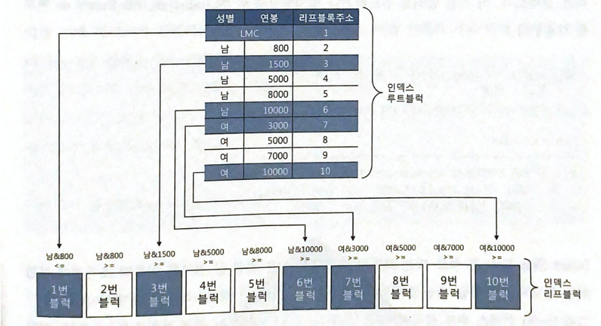

# 2.3 인덱스 확장기능 사용법

인덱스 스캔 방식은 Index Range Scan 외에도 여러가지가 있습니다.

이들에 대해서 알아봅시다.

## 2.3.1 Index Range Scan

Index Range Scan는 가장 일반적이고 정상적인 엑세스 방식입니다.

루트에서 리프노드까지 수직적으로 탐색한 후 필요한 범위만 스캔합니다.

실행계획에서는 `INDEX(RANGE SCAN)` 과 같이 표시됩니다. 


## 2.3.2 Index Full Scan

수직적 탐색 없이 인덱스 리프노드를 처음부터 끝까지 수평적으로 탐색하는 방식입니다.

데이터 검색을 위한 최적의 인덱스가 없을 때 차선으로 선택되는 방식입니다.

실행계획에서는 `INDEX(FULL SCAN)` 과 같이 표시됩니다.


### Index Full Scan의 효용성

인덱스 선두 컬럼이 조건절에 없으면 옵티마이저는 먼저 Table Full Scan을 고려합니다.

하지만 대용량 테이블이면 Table Full Scan의 부담이 큽니다.

따라서 이보다 용량이 작은 인덱스 테이블을 스캔하는 고려를 하게 되고, 

인덱스 스캔 단계에서 대부분 레코드를 필터링하고 일부만 엑세스할 수 있게 된다면 좋은 선택지가 될 것입니다.


아래 쿼리를 생각해봅시다.

``` SQL
SELECT *
FROM EMP
WHERE SAL > 9000
ORDER BY ENAME
```

SAL > 9000 조건의 데이터가 극히 일부라면 위 쿼리는 Index Full Scan을 사용할 것입니다.

실행계획에서는 `INDEX(FULL SCAN)` 과 같이 표시됩니다.


## 2.3.3 Index Unique Scan

Index Unique Scan은 수직적 탐색만으로 데이터를 찾는 방식입니다.

Unique 인덱스를 = 조건으로 탐색하는 경우 작동합니다.

Unique 인덱스가 존재하는 칼럼은 중복 값이 입력되지 않게 DBMS가 정합성을 관리하기 때문에 데이터를 한 건 찾은 이후 더 찾을 필요가 없습니다.

실행계획에서는 `INDEX (UNIQUE SCAN)` 과 같이 표시됩니다.


## 2.3.4 Index Skip Scan

인덱스 선두 칼럼을 조건절에 사용하지 않으면 옵티마이저는 Table Full Scan이나 Index Full Scan을 사용한다고 알아봤습니다.

오라클 같은 경우에는 9i 버전에 새로운 방식, Index Skip Scan을 도입하였습니다.

이 스캔 방식은 조건절에 빠진 **인덱스 선두 칼럼의 Distinct Value 개수가 적고 후행 칼럼의 Distinct Value 개수가 많을 때 유용**합니다.


아래 예시를 봅시다.

이는 (성별, 연봉) 두 칼럼으로 구성된 결합 인덱스입니다.




아래 쿼리를 봅시다.

`index_ss` 는 Index Skip Scan을 유도하는 힌트입니다.

``` SQL
SELECT * /*+ index_ss(사원 사원_IDX) */
FROM 사원
WHERE 성별 = '남'
AND 연봉 between 2000 and 4000
```


이를 통해 조건절에 부합하는 레코드를 포함할 가능성이 있는 리프노드만 골라서 엑세스하게 됩니다.

남 5000 이상인 4번째 리프노드는 가능성이 없으므로 Skip 하였고, 옵티마이저 입장에서 남자와 여자 사이에 다른 성별이 있을지 모르기 때문에 경계값은 확인을 하게 됩니다.

성별 같은 경우는 Distinct Value가 2개 밖에 존재하지 않으므로 유용하게 동작합니다.


하지만 이는 최선책이 될 수 없습니다.

인덱스는 기본적으로 최적의 Index Range Scan을 목표로 설계해야 하며, 수행 횟수가 적은 SQL을 위해 인덱스를 추가하는 것이 비효율적일 때 이 스캔 방식을 사용하여 차선책으로 활용하는 것이 바람직합니다.


## 2.3.5 Index Fast Full Scan

Index Fast Full Scan은 이름 그대로 Index Full Scan보다 빠른 방식입니다. 

빠른 속도를 위해 논리적인 인덱스 트리 구조를 무시하고 인덱스 세그먼트 전체를 Multiblock I/O 방식으로 스캔합니다.

논리적인 인덱스 트리 구조 대신 디스크에 물리적으로 저장되어 있는 순서대로 읽게 됩니다.

따라서 디스크로부터 대량의 인덱스 블록을 읽어야 할 때 효과적입니다.

당연히 인덱스 구조를 무시했기 때문에 결과가 정렬된 상태가 아니고, 쿼리에 사용한 칼럼이 모두 인덱스에 포함되어 있어야 사용할 수 있습니다.


## 2.3.6 Index Range Scan Descending

Index Range Scan과 기본적으로 동일한 스캔 방식입니다.

다만 다른 점이 있다면 인덱스를 뒤에서 부터 앞으로 읽어 내림차순으로 정렬된 결과를 얻게 됩니다.

실행계획은 `INDEX (RANGE SCAN DESCENDING)` 으로 나타납니다.