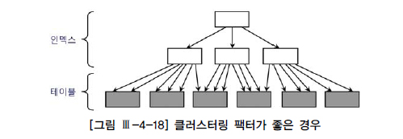
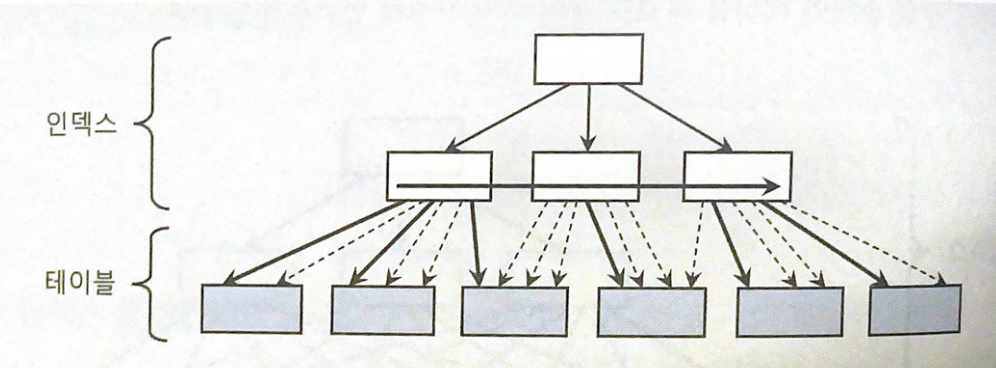
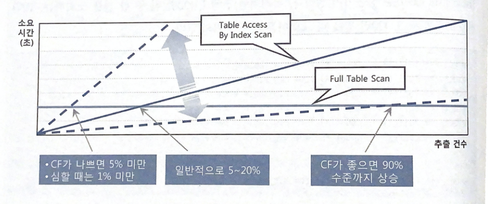

# 3.1 테이블 엑세스 최소화

SQL 튜닝에 있어서 랜덤 I/O가 중요합니다.

이번에는 테이블 랜덤 엑세스가 성능에 미치는 영향을 알아봅시다.


## 3.1.1 테이블 랜덤 엑세스

### 인덱스에 대한 맹신 또는 섣부른 자신감

인덱스를 사용하면 데이터가 아무리 많아도 데이터가 금방 조회됩니다.

하지만 대량 데이터를 조회할 때는 테이블 전체를 스캔할 때보다도 훨씬 느립니다.

왜 이런 현상이 발생하는지 알아봅시다.


### 인덱스 ROWID는 물리적 주소? 논리적 주소?

아래 SQL에 대한 실행계획을 확인해봅시다.

```SQL
SELECT *
FROM 고객
WHERE 지역 = '서울'
```

```
SELECT STATEMENT Optimizer=ALL_ROWS
  TABLE ACCESS BY INDEX ROWID OF '고객' (TABLE)
    INDEX RANGE SCAN OF '고객_지역_IDX' (INDEX)
```


SQL이 참조하는 칼럼 인덱스가 모두 포함하는 경우가 아니면 인덱스를 스캔한 후 반드시 테이블을 엑세스합니다.

이는 실행계획 내에서 `TABLE ACCESS BY INDEX ROWID` 와 같이 나타납니다.


인덱스를 스캔하는 이유는, 검색조건을 만족하는 소량의 데이터를 인덱스에서 빨리 찾고 거기서 테이블 레코드를 찾아가기 위한 주소값 ROWID를 얻으려는데 있습니다.

그렇다면 ROWID는 물리적 주소일까요 논리적 주소일까요?

인덱스 ROWID를 물리적 주소라고 생각한다면 그것이 데이터파일 번호, 오브젝트 번호, 블록 번호 같은 물리적 요소로 구성돼 있어서입니다.

하지만 ROWID는 물리적 주소보다 논리적 주소에 가깝습니다.

물리적으로 직접 연결되어 있다기 보다는 테이블 레코드를 찾아가기 위한 논리적 주소 정보를 담고 있습니다.


ROWID가 C언어에서 말하는 포인터로 이해하기 쉽지만 실제로 그렇지 않습니다.

인덱스 ROWID는 논리적 주소이며 디스크 상에서 테이블 레코드를 찾아가기 위한 위치 정보를 담습니다.


### 메인 메모리 DB와 비교

메인 메모리 DB(MMDB)는 데이터를 모두 메모리에 로드해놓고 메모리를 통해서만 I/O를 수행하는 DB입니다.

잘 튜닝된 OLTP성 데이터베이스 시스템이라면 버퍼 캐시 히트율잉 99% 이상이므로 사실상 대부분의 데이터를 메모리에서 읽는다는 뜻입니다.

하지만 이는 MMDB만큼 빠르지 않고 특히 대량 데이터를 인덱스로 액세스 할 때 차이가 많이 납니다.


그 이유는 MMDB의 구조에 있습니다.

MMDB의 인덱스는 오라클처럼 디스크 상의 주소 정보를 갖는게 아니라 메모리 상의 주소정보, 즉 포인터를 갖습니다.

따라서 인덱스를 경유해 테이블을 엑세스하는 비용이 오라클과 비교할 수 없을 정도로 낮습니다.

그에 비해 오라클은 테이블 블록이 수시로 버퍼캐시에서 밀려 났다가 다시 캐싱되며, 그 때 마다 다른 공간에 캐싱되기 때문에 인덱스에서  포인터로 직접 연결할 수 없는 구조입니다.

메모리 주소 정보인 포인터가 아닌 디스크 주소 정보인 DBA(Data Block Address)를 이용해 해시 알고리즘으로 버퍼 블록을 찾아갑니다.


### I/O 메커니즘 복습

I/O 메커니즘에 대해서 복습해봅시다.

DBA는 디스크 상에서 블록을 찾기 위한 주소 정보입니다.

그렇다고 매번 디스크에서 블록을 읽을 수는 없고 버퍼캐시를 활용해야 합니다.

읽고자하는 DBA를 해시 함수에 입력해서 해시 체인을 찾고 거기서 버퍼 헤더를 찾습니다.

인덱스로 테이블 블록을 엑세스 할 때는 ROWID를 분해하여 DBA 정보를 얻고, 테이블을 Full Scan할 때는 익스텐트 맵을 통해 읽을 블록들의 DBA 정보를 얻습니다.

모든 데이터가 캐싱되어 있더라도 테이블 레코드를 찾기 위해 매번 DBA 해싱과 래치 획득 과정을 반복해야 합니다.

동시 액세스가 심할 때는 캐시버퍼 체인 래치와 버퍼 Lock에 대한 경합까지 발생합니다.

이러한 이유로 ROWID를 이용한 테이블 액세스는 생각보다 고비용 구조입니다.


### 인덱스 ROWID는 우편주소

디스크 DB가 사용하는 ROWID를 우편주소에, MMDB가 사용하는 포인터를 전화번호에 비유할 수 있습니다.

전화통신은 물리적으로 연결되어 곧바로 상대방과 통화할 수 있지만 우편통신은 봉투에 적힌 대로 우체부 아저씨가 일일이 찾아다니는 구조이므로 전화와는 비교할 수 없이 느립니다.


## 3.1.2 인덱스 클러스터링 팩터

클러스터링 팩터는 Clustering Factor의 줄임말로 CF라고도 부릅니다.

특정 칼럼을 기준으로 같은 값을 갖는 데이터가 서로 모여있는 정도를 의미합니다.

CF가 좋은 칼럼에 생성한 인덱스는 검색 효율이 매우 좋습니다.


CF가 좋은 경우는 아래 그림과 같이 인덱스 레코드 정렬 순서와 테이블 레코드 정렬 순서가 100% 일치합니다.

그렇지 않은 경우는 두 순서가 일치하지 않아 화살표가 꼬여있습니다. 




여기서 한 가지 의문이 생길 수 있습니다.

인덱스 레코드마다 테이블 레코드를 건건이 블록 단위로 I/O 한다면 CF가 달라도 블록 I/O 발생량에 차이가 없어야 정상입니다.

하지만 왜 CF가 높으면 I/O가 줄을까요?

아애 그림을 봅시다.

실선은 실제로 블록 I/O가 발생하는 상황입니다.




인덱스 ROWID로 테이블을 액세스할 때 오라클은 래치 획득과 해시 체인 스캔 과정을 거쳐 어렵게 찾아간 테이블 블록에 대한 포인터를 바로 해제하지 않고 일단 유지합니다.

이를 **버퍼 Pinning**이라고 부릅니다.

이 상태에서 다음 인덱스 레코드가 직전과 같은 테이블 블록을 가리킨다면 래치 획득과 체인 스캔 과정을 생략하고 바로 테이블 블록을 읽을 수 있습니다.


## 3.1.3 인덱스 손익분기점

인덱스 ROWID를 이용한 테이블 액세스는 생각보다 고비용 구조입니다.

따라서 읽어야 할 데이터가 일정량을 넘는 순간, 테이블 전체를 스캔하는 것보다 오히려 느려집니다.

Index Range Scan에 의한 테이블 액세스가 Table Full Scan보다 느려지는 지점을 흔히 **인덱스 손익분기점** 이라고 합니다.


Table Full Scan은 항상 일정한 성능을 보입니다.

한 건의 데이터를 조회해도, 테이블 전체의 데이터를 조회해도 말이죠.

하지만 인덱스를 이용한 테이블 액세스는 몇 건을 추출하느냐에 따라 성능이 크게 달라집니다.

인덱스를 이용한 테이블 액세스가 Table Full Scan보다 더 느려지게 만드는 가장 핵심적인 두 가지 요인은 다음과 같습니다.

* Table Full Scan은 시퀄셜 액세스인 반면, 인덱스 ROWID를 이용한 테이블 액세스는 랜덤 액세스 방식입니다.
* Table Full Scan은 Multiblock I/O인 반면, 인덱스 ROWID를 이용한 테이블 액세스는 Single Block I/O 방식입니다.


이러한 이유로 인덱스 손익분기점은 5~20%의 낮은 수준에서 결정됩니다.

인덱스 CF가 나쁘면 같은 테이블 블록을 여러 번 반복 액세스 하면서 I/O가 늘기 때문에 CF에 따라 크게 달라집니다.




## 3.1.4 인덱스 칼럼 추가

테이블 액세스 최소화를 위해 가장 일반적인 방법은 인덱스에 칼럼을 추가하는 것입니다.

(DEPTNO, JOB)으로 구성된 인덱스에 대해서 아래 쿼리를 수행한다고 생각해봅시다.

``` SQL
SELECT *
FROM EMP
WHERE DEPTNO = 30
AND SAL >= 2000
```


이 경우 인덱스에서 DEPTNO가 30인 데이터들을 찾으면 ROWID를 통해 테이블 액세스가 이루어집니다.

그리고 SAL 값을 확인하게 되겠죠.

즉, 해당하는 데이터가 극 소량이더라도 이를 찾기 위해 테이블을 여러 번 액세스하게 될 것 입니다.


인덱스 구성을 (DEPTNO, SAL) 순으로 변경하면 좋겠지만 기존 인덱스를 사용하는 SQL 등이 있을 수 있기 때문에 운영 환경에서 인덱스 구성을 변경하는 것이 쉽지 않습니다.

그렇다고 해당 인덱스를 새로 추가하면 인덱스 관리 비용이 증가하고 트랜잭션 성능에 까지 영향을 미칩니다.

이럴 때는 SAL 칼럼을 인덱스에 추가하는 것 만으로도 큰 효과를 얻을 수 있습니다.

인덱스 스캔량은 줄지 않지만 테이블 랜덤 액세스 횟수를 줄일 수 있습니다.


## 3.1.5 인덱스만 읽고 처리

테이블 액세스 단계 필터 조건에 의해 버려지는 레코드가 많을 때는 인덱스에 칼럼을 추가함으로써 성능을 향상 시킬 수 있습니다.

하지만 테이블 램덤 액세스가 많아도 필터 조건에 의해 버려지는 레코드가 거의 없다면 어떻게 튜닝을 해야할까요?

쿼리나 인덱스에 문제가 있는 것이 아니라 절대 일량이 많아서 느린거니 어쩔 수 없습니다.

반드시 성능 개선을 해야한다면 쿼리에 사용된 칼럼을 모두 인덱스에 추가해서 테이블 액세스가 아예 발생하지 않게 하는 방법도 있습니다.

이렇게 인덱스만 읽어서 처리하는 쿼리를 Covered 쿼리라고 하며 그 쿼리에 사용한 인덱스를 Covered 인덱스라고 부릅니다.

하지만 추가해야 할 칼럼이 많아 실제 적용하기 곤란한 경우가 많습니다.


## 3.1.6 인덱스 구조 테이블

인덱스를 이용한 테이블 액세스가 고비용 구조라고 하니 랜던 액세스가 아예 발생하지 않도록 테이블을 인덱스 구조로 생성하면 어떨까요?

오라클에서는 이를 IOT(Index-Oranized Table)이라고 하고 MS-SQL Server에서는 클러스터형 인덱스라고 부릅니다.

테이블을 찾아가기 위한 ROWID를 갖는 일반  인덱스와 달리 IOT는 그 자리에 테이블 데이터를 갖습니다.


테이블을 인덱스 구조로 만드는 구문은 아래와 같습니다.

```SQL
CREATE TABLE INDEX_ORG_T (
    a number,
    b varchar(10),
    constraint index_org_t_pk primary key (a)
)
orgranization index;
```


IOT는 인위적으로 클러스터링 팩터를 좋게 만드는 방법 중 하나입니다.

값은 값을 가진 레코드들이 100% 정렬된 상태로 모여 있으므로 랜덤 액세스가 아닌 시퀄셜 방식으로 데이터를 액세스하게 되고, 따라서 BETWEEN이나 부등호 조건으로 넓은 범위를 읽을 때 유리합니다.


## 3.1.7 클러스터 테이블

클러스터 테이블에는 인덱스 클러스터와 해시 클러스터 두 가지가 있습니다.


### 인덱스 클러스터 테이블

인덱스 클러스터 테이블은 클러스터 키 값이 같은 레코드를 한 블록에 모아서 저장하는 구조입니다.

한 블록에 모두 담을 수 없을 때는 새로운 블록을 할당해서 클러스터 체인으로 연결합니다.


인덱스 클러스터 테이블을 구성하려면 먼저 클러스터를 생성해야합니다.

``` SQL
CREATE CLUSTER C_DEPT# (DEPTNO NUMBER(2)) INDEX;
```


다음으로 클러스터 인덱스를 정의해야 합니다.

해당 인덱스를 사용하여 데이터를 검색하고 데이터가 저장될 위치도 찾습니다.

```SQL
CREATE INDEX C_DEPT#_IDX ON CLUSTER C_DEPT#;
```


클러스터 인덱스를 만들었으면 클러스터 테이블을 생성해야합니다.

```SQL
CREATE TABLE DEPT (
    DEPTNO NUMBER(2) NOT NULL
  , DNAME VARCHAR2(14) NOT NULL
  , LOC VARCHAR2(13)
) CLUSTER C_DEPT#(DEPTNO);
```


클러스터 인덱스는 테이블 레코드를 일일이 가리키지 않고 해당 키 값을 저장하는 첫 번째 데이터 블록을 가리킨다는 점이 다릅니다.

즉 일반 테이블에 생성한 인덱스 레코드는 테이블 레코드와 1:1 대응 관계를 갖지만 클러스터 인덱스는 테이블 레코드와 1:M 관계를 갖습니다.

이런 구조적 특성 때문에 클러스터 인덱스를 스캔하면서 값을 찾을 때는 랜덤 액세스가 값 하나당  한 번씩 밖에 발생하지 않습니다.


### 해시 클러스터 테이블

해시 클러스터는 인덱스를 사용하지 않고 해시 알고리즘을 사용해 클러스터를 찾아간다는 점만 다릅니다.

``` SQL
CREATE CLUSTER C_DEPT# (DEPTNO NUMBER(2)) HASHKEYS 4;
```


이제 위와 마찬가지로 클러스터 테이블을 생성합니다.

```SQL
CREATE TABLE DEPT (
    DEPTNO NUMBER(2) NOT NULL
  , DNAME VARCHAR2(14) NOT NULL
  , LOC VARCHAR2(13)
) CLUSTER C_DEPT#(DEPTNO);
```


