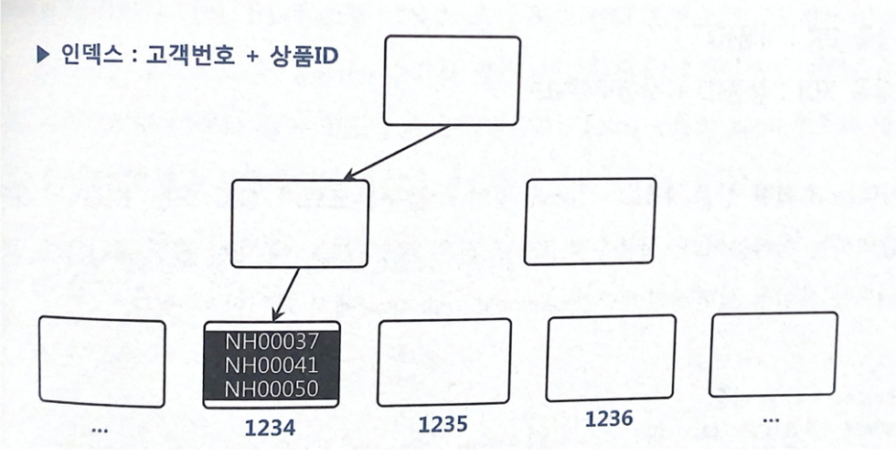

# 3.3 인덱스 스캔 효율화

운영 환경에서 가장 일반적인 튜닝 기법은 인덱스 칼럼 추가입니다.

인덱스 스캔 효율화는 튜닝 요소가 매우 다양합니다.


## 3.3.2 인덱스 스캔 효율성

인덱스 스캔 효율성을 높이기 위해서는 인덱스 선행 컬럼이 조건절에 있어야 합니다.

인덱스 선행 칼럼이 조건절에 없거나 = 조건이 아니면 인덱스 스캔 과정에 비효율이 발생합니다.


### 인덱스 스캔 효율성 측정

인덱스 스캔 효율성을 측정하기 위해서는 SQL 트레이스를 통해 쉽게 알 수 있습니다.

```
Rows     Row Source Operation
10       TABLE ACCESS BY INDEX ROWID BIG_TABLE (cr=7471 pr=1466 pw=0 time=22137 us)
10           INDEX RANGE SCAN BIG_TABLE_IDX (cr=7463 pr=1466 pw=0 time=22328 us)
```


위 트레이스를 보면 인덱스를 스캔하고 10개의 Rows를 얻었습니다.

이를 위해 7463개의 블록을 읽었고, 인덱스 리프 블록에는 훨씬 더 많은 레코드가 담기니까 한 블록 당 평균 500개 레코드가 담긴다고 하면 3,731,500(=7,463*500)개 레코드를 읽은 것입니다.

즉 저 많은 데이터를 읽고 10개를 얻은거면 비효율적이라고 볼 수 있습니다.

​                                                                                                                                                                                       

## 3.3.3 액세스 조건과 필터 조건

인덱스 스캔 효율성을 계속 설명하기에 앞서 반드시 이해해야 할 용어가 두 가지 있습니다.

액세스 조건과 필터 조건입니다.


인덱스 액세스 조건은 인덱스 스캔 범위를 결정하는 조건절입니다.

인덱스를 수직적 탐색하여 스캔 시작점과 끝지점을 결정합니다.

인덱스 필터 조건은 테이블로 액세스할지를 결정하는 조건절입니다.


## 3.3.4 비교 연산자 종류와 칼럼 순서에 따른 군집성

선행 칼럼이 모두 =조건인 상태에서 첫 번째 나타나는 범위 검색 조건까지만 만족하는 인덱스 레코드는 모두 연속해서  모여있지만 그 이하 조건까지 만족하는 레코느는 비교 연산자 종류에 상관없이 흩어집니다.

아래 예시를 봅시다.

``` SQL
WHERE C1 = 1
AND C2 = 'A'
AND C3 BETWEEN '가' AND '다'
AND C4 = 'a'
```


첫 번째 나타나는 범위 검색 조건인 C3까지는 인덱스 레코드가 모두 모여있지만 C4까지 만족하는 레코드는 그 안에서 흩어지게 됩니다.

이 경우 인덱스 액세스 조건은 C1, C2, C3가 되고 인덱스 필터 조건은 C4가 됩니다.


## 3.3.5 인덱스 선행 칼럼이 등치(=) 조건이 아닐 때 생기는 비효율

인덱스 스캔 효율성은 인덱스 칼럼을 조건절에 모두 = 조건으로 사용할 때가 가장 좋습니다.

이 경우 리프노드를 스캔하면서 읽은 레코드가 전부 테이블 액세스로 이어지므로 비효율이 발생하지 않습니다.


인덱스 칼럼 중 일부가 조건절에 없거나 = 조건이 아니더라도 그것이 인덱스의 뒤쪽 컬럼일수록 비효율이 감소합니다.

인덱스가 (아파트시세코드, 평형, 평형타입, 인터넷매물)로 이루어져 있을 때 아래 쿼리를 생각해봅시다.

``` SQL
SELECT 해당층
FROM 매물아파트매매
WHERE 아파트시세코 = 'A010'
AND 평형 = '59'
AND 평형타입 = 'A'
AND 인터넷매물 between '1' and '3'
```


인덱스의 가장 마지막 칼럼인 (인터넷매물)이 = 조건이 아닌 between이지만 비효율이 발생하지 않습니다.

3.3.4에서 봤듯이 첫 번째 범위 검색 조건까지는 데이터들이 군집을 이루고 있습니다.


만약 인덱스를 바꿔 인터넷매물 칼럼이 앞 쪽에 위치한다면 그 뒤 쪽 데이터는 흩어져 있게 되므로 비효율이 발생합니다.


## 3.3.6 BETWEEN을 IN-List로 전환

위처럼 범위검색 칼럼이 맨 뒤로 가도록 인덱스를 변경하면 좋겠지만 인덱스의 구성을 바꾸기 쉽지 않습니다.

이 때는 BETWEEN 조건을 아래와 같이 IN-List로 바꿔주면 큰 효과를 얻을 수 있습니다.

이 경우, BETWEEN 조건에 들어가는 모든 값들을 = 조건으로 각각 검색한 후 union all을 하게 됩니다.

즉 각각에 대하여 효율적인 인덱스 탐색이 이루어지게 되는 것이죠.

하지만 IN-List 내에 항목 개수가 늘어날 수 있다면 해당 방식은 오히려 더 비효율적으로 바뀔 가능성이 있습니다.


### BETWEEN 조건을 IN-List로 전환할 때 주의 사항

BETWEEN 조건을 IN-List 조건으로 전환할 때 주의할 점은 IN-List의 개수입니다.

개수가 많다면 수직적 탐색이 많이 발생하고 리프노드를 많이 스캔하는 것보다 비효율적일 수 있습니다.

또한 인덱스 스캔 과정에서 선택되는 레코드들이 서로 멀리 떨어져있을 때만 유용합니다.

가까이 있다면 리프노드를 얼마 탐색안하고도 멈출 수 있습니다.


## 3.3.7 Index Skip Scan 활용

BETWEEN 조건을 IN-List 조건으로 변환하면 도움이 되는 상황에서 Index Skip Scan을 사용해도 효과가 있습니다.


월별고객판매집계 테이블에 2018년 1월부터 12월까지 월별로 10만 개의 판매데이터가 있습니다.

총 120만개이고, 이 중 판매구분값으로는 A가 10만 개, B가 110만 개입니다.


아래와 같은 쿼리를 수행한다고 가정합시다.

``` SQL
SELECT COUNT(*)
FROM 월별고객별판매집계 T
WHERE 판매구분 = 'A'
AND 판매월 BETWEEN '201801' AND '201812'
```


해당 쿼리를 최적으로 수행하려면 = 조건은 판매구분이 선두칼럼에 위치하도록 (판매구분, 판매월)과 같이 인덱스를 구성해야합니다.

인덱스가 (판매월, 판매구분) 일 경우에는 Index Skip Scan을 사용하여 성능을 개선할 수 있습니다.

선두 칼럼이 BETWEEN이어서 나머지 검색 조건을 만족하는 데이터들이 서로 멀리 떨어져 있을 때 Index Skip Scan이 좋습니다.


## 3.3.8 IN 조건은 =인가

흔히들 IN 조건을 = 조건과 동등시 합니다.

두 개의 인덱스 (상품ID, 고객번호), (고객번호, 상품ID)에 대해 아래 쿼리는 어떤 차이가 있을까요?

``` SQL
SELECT *
FROM 고객별가입상품
WHERE 고객번호 = :cust_no
AND 상품ID in ('NH00037', 'NH00041', 'NH00050')
```


고객별가입상품 테이블에서 고객번호의 평균 카디널리티는 3이라고 합시다.

즉, 고객별로 평균 세 건의 상품을 가입합니다.

이 상황에서 인덱스를 (상품ID, 고객번호) 으로 생성하면 같은 상품은 고객번호 순으로 정렬된 상태로 하나의 리프노드에 저장됩니다.

반면, 고객번호 기준으로는 같은 고객번호가 상품ID에 따라 흩어진 상태가 됩니다.

고객번호가 흩어져있는 이런 상황에서는 상품ID 조건절이 IN-List Iterator 방식으로 풀리는 것이 효과적입니다.

아래와 같이 말이죠.

```SQL
SELECT *
FROM 고객별가입상품
WHERE 고객번호 = :cust_no
AND 상품ID = 'NH00037'
UNION ALL
SELECT *
FROM 고객별가입상품
WHERE 고객번호 = :cust_no
AND 상품ID = 'NH00041'
UNION ALL
SELECT *
FROM 고객별가입상품
WHERE 고객번호 = :cust_no
AND 상품ID = 'NH00050'
```

고객번호와 상품ID 둘 다 인덱스액세스 조건으로 사용됩니다.


이번에는 (상품ID, 고객번호) 인덱스를 생각해봅시다.

이제 같은 고객은 상품ID 순으로 정렬된 상태로 같은 리프노드에 저장됩니다.




이제 다시 IN-List Iterator 방식으로 푼다고 생각을 해봅시다.

각 상품번호에 대한 SELECT 쿼리가 3개 생성되고 각각 수직적으로 내려오면서 3개의 블록을 탐색, 즉 9개의 블록을 읽게 됩니다.


IN-List Iterator 방식으로 풀지 않지 않으면 상품ID 조건절은 필터로 처리합니다.

그러면 고객번호만 액세스 조건이므로 고객번호 1234인 레코드를 모두 스캔하고 모두 한 블록에 모여있으므로 총 3개의 블록만을 탐색합니다.


즉, IN 조건은 =이 아닙니다. 

IN-List Iterator 방식으로 풀려야 = 조건이 되고 그렇지 않으면 필터조건일 뿐입니다.

앞에서 봤듯이 IN-List Iterator 푸는 것이 항상 효과적이진 않습니다.

위 상황에서 IN-List Iterator로 풀려서 상품ID가 액세스 조건으로 의미가 있으려면 고객별 상품 데이터가 아주 많아야합니다.


### NUM_INDEX_KEYS 힌트 활용

 `NUM_INDEX_KEYS` 을 사용하면 인덱스 액세스 조건을 어디 칼럼까지 사용할 지 지정할 수 있습니다.

힌트의 세 번째 인자가 1이면 인덱스 첫 번째 칼럼까지만 액세스 조건으로 사용하라는 의미입니다.

```SQL
SELECT /*+ NUM_INDEX_KEYS(a 고객별가입상품_X1 1)*/ *
FROM 고객별가입상품 a
WHERE 고객번호 = :cust_no
AND 상품ID in ('NH00037', 'NH00041', 'NH00050')
```


아니면 인덱스 칼럼을 가공하는 방법도 있습니다.

```SQL
SELECT *
FROM 고객별가입상품 a
WHERE 고객번호 = :cust_no
AND 상품ID || '' in ('NH00037', 'NH00041', 'NH00050')
```


## 3.3.9 BETWEEN과 LIKE 스캔 범위 비교

BETWEEN과 LIKE는 둘 다 범위검색 조건으로서 데이터 분포와 조건절 값에 따라 인덱스 스캔량이 서로 다릅니다.

사용하기에는 LIKE가 더 편하지만 BETWEEN을 사용하면 적어도 손해는 안봅니다.


인덱스를 (판매월, 판매구분)으로 설정하고 판매구분은 A와 B가 90%, 10% 존재합니다.

이 상황에서 인덱스 스캔량을 확인해봅시다.

``` SQL
-- 조건절 1
WHERE 판매월 BETWEEN '201901' AND '201912'
AND 판매구분 = 'B'

-- 조건절 2
WHERE 판매월 LIKE '2019%'
AND 판매구분 = 'B'
```


조건절 1은 판매월 201901 이고 판매구분이 B인 레코드에서 스캔을 시작합니다.

반면 조건절 2는 판매월 201901인 첫 번째 레코드에서 스캔을 시작합니다.

혹시라도 201900이 저장되어 있을 수 있기 때문에 판매구분이 B인 지점으로 바로 내려갈 수 없습니다.

