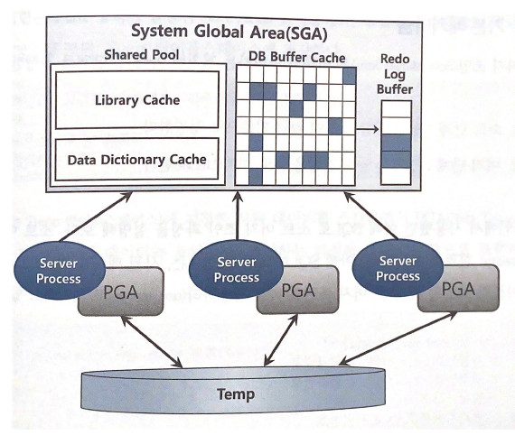

# 4.2 소트 머지 조인

조인 칼럼에 인덱스가 없을 때, 대량 데이터 조인이어서 인덱스가 효과적이지 않을 때, 옵티마이저는 NL 조인 대신 소트 머지 조인이나 해시 조인을 선택합니다.

해시 조인의 등장으로 소트 머지 조인의 쓰임새가 예전만 못하지만 해시 조인을 사용할 수 없는 상황에서 대량 데이터를 조인하고자 할 때 유용합니다.


## 4.2.1 SGA VS PGA

공유 메모리 영역인 SGA에 캐시된 데이터는 여러 프로세스가 공유할 수 있습니다.

공유는 할 수 있지만 동시에 액세스할 수는 없습니다.

오라클 서버 프로세스는 SGA에 공유된 데이터를 읽고 쓰면서, 동시에 자신만의 고유 메모리 영역을 가집니다.

각 오라클 서버 프로세스에 할당된 메모리 영역을 PGA라고 부르며 프로세스에 종속적인 고유 데이터를 저장하는 용도로 사용합니다.

할당 받은 PGA 공간이 작아 데이터를 모두 저장할 수 없을 때는 Temp 테이블스페이스를 이용합니다.


PGA는 독립적인 메모리 공간이므로 래치 매커니즘이 불필요하고 같은 양의 데이터를 읽더라도 SGA 버퍼캐시에서 읽을 때보다 훨씬 빠릅니다.




## 4.2.2 기본 매커니즘

소트 머지 조인은 이름대로 아래 두 단계로 진행합니다.

* 소트 단계 : 양쪽 집합을 조인 칼럼 기준으로 정렬합니다.
* 머지 단계 : 정렬한 양쪽 집합을 서로 머지합니다.


소트 머지 조인은 use_merge 힌트를 이용하여 사용할 수 있습니다.

4.1에서 사용했던 쿼리를 소트 머지 조인 시 어떻게 동작하는지 살펴봅시다.

```SQL
SELECT /* ordered use_merge(c) */
	e.사원번호, e.사원명, e.입사일자
	c.고객번호, c.고객명, c.전화번호, c.최종주문금액
FROM 사원 e, 고객 c
WHERE c.관리사원번호 = e.사원번호
AND e.입사일자 >= '19960101'  
AND e.부서코드 = '2123'       
AND c.최종주문금액 >= 20000   
```


### 1단계

조건에 해당하는 사원 데이터를 읽어 조인칼럼인 사원번호로 정렬합니다.

정렬한 결과 집합은 PGA 영역에 할당된 Sort Area에 저장합니다.

PGA에 담을 수 없을 정도로 크다면 Temp 테이블스페이스에 저장합니다.


### 2단계 

조건에 해당하는 고객 데이터를 읽어 조인칼럼인 관리사원번호로 정렬합니다.

정렬한 결과 집합은 PGA 영역에 할당된 Sort Area에 저장합니다.

PGA에 담을 수 없을 정도로 크다면 Temp 테이블스페이스에 저장합니다.


### 3단계

PGA 또는 Temp에 저장한 사원 데이터를 스캔하면서 마찬가지로 저장한 고객 데이터와 조인합니다.


### 결론

이를 통해서 사원 데이터를 기준으로 고객 데이터를 매번 Full Scan 하지 않아도 됩니다.

고객 데이터가 정렬되어 있기 때문에 조인 대상 레코드가 시작되는 지점을 쉽게 찾을 수 있고 조인에 실패하는 레코드를 만나는 순간 바로 멈출 수 있습니다.


## 4.2.3 소트 머지 조인이 빠른 이유

NL 조인은 모든 DBMS가 공통으로 제공하는 가장 전통적인 조인 방식입니다.

하지만 대량 데이터를 조인할 때 성능이 매우 느립니다.


소트 머지 조인은 Sort Area에 미리 정렬 둔 자료구조를 이용한다는 점만 다를 뿐 조인 프로세스는 NL조인과 같습니다.

그렇다면 둘의 성능 차이는 어디서 발생하는걸까요?

### NL 조인

NL 조인은 인덱스를 이용한 조인 방식으로 조인 과정에서 액세스하는 모든 블록을 랜덤 액세스 방식으로 건건이 DB 버퍼캐시를 경유해서 읽습니다.

즉 인덱스든 테이블이든 읽는 모든 블록에 래치 획득 및 캐시버퍼 체인 스캔 과정을 거칩니다.

버퍼캐시에서 찾지 못한 블록은 건건이 디스크에서 읽어 들입니다.


### 소트 머지 조인

반면에 소트 머지 조인은 양쪽 테이블로부터 조인 대상 집합을 일괄적으로 읽어 PGA에 저장한 후 조인합니다.

PGA는 프로세스만을 위한 독립적인 메모리 공간이므로 데이터를 읽을 때 래치 획득 과정이 없습니다.

따라서 소트 머지 조인이 대량 데이터 조인에 유리합니다.


## 4.2.4 소트 머지 조인의 주용도

소트 머지 조인은 해시 조인보다 성능이 좋지 않아 그 쓰임새가 예전만 못합니다.

따라서 아래와 같은 상황에 주로 사용합니다.

* 조인 조건식이 =조건이 아닌 대량 데이터 조인
* 조인 조건식이 아예 없는 조인(Cross Join)


## 4.2.5 소트 머지 조인 제어하기

아래는 소트 머지 조인에 대한 실행계획입니다.

``` 
SELECT STATEMENT Optimizer=ALL_ROWS
	MERGE JOIN
		SORT (JOIN)
			TABLE ACCESS (BY INDEX ROWID) OF '사원' (TABLE)
				INDEX (RANGE SCAN) OF '사원X1' (INDEX)
    SORT (JOIN)
    	TABLE ACCESS (BY INDEX ROWID) OF '고객' (TABLE)
				INDEX (RANGE SCAN) OF '고객X1' (INDEX)
```


## 4.2.6 소트 머지 조인 특징 요약

소트 머지 조인은 양 쪽 집합을 정렬한 다음에 NL 조인과 같은 방식으로 진행하지만 PGA 영역에 저장한 데이터를 이용해 빠릅니다.

따라서 소트 부하만 감수한다면 건건이 버퍼캐시를 경유하는 NL조인보다 빠릅니다.

NL조인이 인덱스 유무에 크게 영향을 받지만 소트 머지 조인은 영향을 받지 않습니다.

스캔 위주의 액세스 방식을 사용하는 것도 중요한 특징입니다.