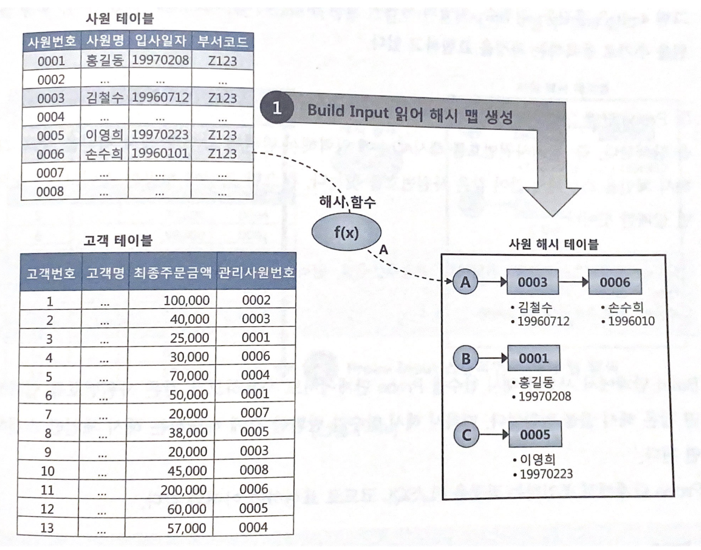

# 4.3 해시 조인

NL 조인은 인덱스를 이용한 조인 방식으로 인덱스 구성에 따른 성능 차이가 심합니다.

인덱스를 아무리 완벽하게 구성해도 랜덤 I/O 때문에 대량 데이터 처리에 불리하고 버퍼캐시 히트율에 따라 성능의 편차가 큽니다.


소트 머지 조인은 항 상 양쪽 테이블을 정렬하는 부담이 있는데 해시 조인은 그런 부담도 없습니다.

<br>

## 4.3.1 기본 매커니즘

해시 조인은 소트 머지 조인처럼 두 단계로 진행됩니다.

* Build 단계 : 작은 쪽 테이블을 읽어서 해시 테이블을 생성
* Probe 단계 : 큰 쪽 테이블을 읽어 해시 테이블을 탐색하면서 조인


앞에서 봤던 예시를 통해 다시 알아봅시다.

use_hash는 해시 조인을 유도하는 힌트입니다.

```SQL
SELECT /* ordered use_hash(c) */
	e.사원번호, e.사원명, e.입사일자
	c.고객번호, c.고객명, c.전화번호, c.최종주문금액
FROM 사원 e, 고객 c
WHERE c.관리사원번호 = e.사원번호
AND e.입사일자 >= '19960101'  
AND e.부서코드 = '2123'       
AND c.최종주문금액 >= 20000   
```


이를 그림으로 나타내면 아래와 같습니다.



* Build 단계 : 아래 조건에 해당하는 사원 데이터를 읽어 해시 테이블을 생성합니다. 이 때 조인 칼럼인 사원번호를 해시 테이블 키 값으로 사용합니다.

  해시 테이블은 PGA 영역에 할당된 Hash Area에 저장합니다. 

  이 때 해시 테이블이 너무 커 PGA에 담을 수 없다면 Temp 테이블스페이스에 저장합니다.

* Probe 단계 : 아래 조건에 해당하는 고객 데이터를 하나씩 읽어서 앞서 생성한 해시 테이블을 탐색합니다. 

  ```SQL
  SELECT 고객번호, 고객명, 전화번호, 최종주문금액, 관리사원번호
  FROM 고객
  WHERE 최종주문금액 >= 20000
  ```

<br>

## 4.3.2 해시 조인이 빠른 이유

### 해시조인 VS NL조인

Hash Area에 생성한 해시 테이블을 이용한다는 점만 다를 뿐 해시 조인도 조인 프로세싱 자체는 NL조인과 같습니다.

하지만 해시 조인이 빠른 이유는 해시 테이블을 PGA 영역에 할당하기 때문입니다.

NL 조인은 Outer 테이블 레코드마다 Inner 테이블 레코드를 읽기 위해 래치 획득 및 캐시버퍼 체인 스캔 과정을 반복하지만 해시 조인은 그 과정없이  PGA에서 빠르게 데이터를 탐색하고 조인합니다.


### 해시조인 VS 소트머지조인

둘 다 PGA에서 처리한다는 공통점이 있습니다.

하지만 대량 데이터를 조인할 때는 일반적으로 해시조인이 더 빠릅니다.

소트 머지 조인은 양 쪽 집합을 정렬해서 PGA에 담게 되는데 하나의 테이블이 크다면 Temp 테이블스페이스, 즉 디스크에 쓰는 작업을 수반합니다.

그에 비해 해시조인은 둘 중 작은 집합을 해시 맵으로 선택하므로 Temp 테이블스페이스, 즉 디스크에 쓰는 작업은 잘 일어나지 않습니다.

<br>

## 4.3.3 대용량 Build Input 처리

만약 두 테이블이 모두 대용량 테이블이라면 인메모리 해시 조인이 불가능합니다.

이 경우 분할 정복 방식을 사용합니다.


* 파티션 단계

  조인하는 양쪽 테이블의 조인 칼럼에 해시 함수를 적용하고 반환된 해시 값에 따라 동적으로 파티셔닝합니다.
  양쪽 집합을 읽어 디스크 Temp 공간에 저장해야 하므로 인메모리 해시 조인보다 성능이 많이 떨어집니다.

* 조인 단계

  각 파티션에 대해 하나씩 조인을 수행합니다. 이 때 각각의 대한 Build Input과 Probe Input은 독립적으로 결정됩니다.
  즉 어느 쪽이 작은 테이블이었는지 상관없이 파티션 별로 작은 쪽을 택해 해시테이블을 생성합니다.

<br>

## 4.3.4 해시 조인 실행계획 제어

옵티마이저는 일반적으로 카디널리티가 작은 테이블을 택해 해시 테이블을 생성합니다.

leading이나 ordered 힌트가 있다면 가장 먼저 읽는 테이블을 Build Input으로 선택합니다.


### 세 개 이상 테이블 해시 조인

세 테이블을 조인하는 경로는 아래와 같습니다.

T1 <-> T2 <-> T3

<br>

## 4.3.5 조인 메소드 선택 기준

소량 데이터 조인할 때 -> NL 조인

대량 데이터이고 등치조건일 때 -> 해시 조인

대량 데이터이고 등치조건이 아닐 때 -> 소트 머지 조인

여기서 소량과 대량의 기준은 단순히 데이터량의 많고 적음이 아니라 NL 조인 기준으로 최적화했는데도 랜덤 액세스가 많아 만족할만한 성능을 낼 수 없다면 대량 데이터 조인으로 봐야합니다.


수행빈도가 매우 높은 쿼리에 대해서는 아래 기준도 고려할 수 있습니다.

1. NL 조인과 해시 조인 성능이 같으면 NL 조인
2. 해시 조인이 약간 더 빨라도 NL 조인
3. NL 조인보다 해시 조인이 매우 빠른 경우, 해시 조인


### NL 조인을 우선시 하는 이유

NL 조인에 사용하는 인덱스는 영구적으로 유지하면서 다양한 쿼리를 위해 공유 및 재사용하는 자료구조입니다.

반면 해시 테이블은 단 하나의 쿼리를 위해 생성하고 조인이 끝나면 바로 소멸하는 자료구조입니다.


<br>

결론적으로 해시 조인은 아래 세 가지 조건을 만족하는 SQL문에서 주로 사용합니다.

* 수행 빈도가 낮고
* 쿼리 수행 시간이 오래 걸리는
* 대량 데이터 조인