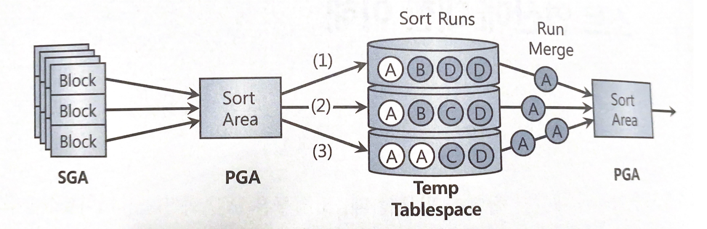

# 5.1 소트 연산에 대한 이해

데이터를 소트하거나 그룹핑하는 과정을 살펴봅시다.


## 5.1.1 소트 수행 과정

소트는 기본적으로 PGA에 할당한 Sort Area에서 이루어집니다.

메모리 공간인 Sort Area가 다 차면, 디스크 Temp 테이블스페이스를 활용합니다.

* 메모리 소트 : 전체 데이터의 정렬 작업을 메모리 내에서 완료하는 것을 말합니다.
* 디스크 소트 : 할당받은 Sort Area 내에서 정렬을 완료하지 못해 디스크 공간까지 사용하는 경우를 말합니다.


### 소트 수행 과정

소트할 대상 집합을 SGA 버퍼캐시를 통해 읽어들이고, 일차적으로 Sort Area에서 정렬을 시도합니다.

Sort Area 내에서 데이터 정렬을 마무리하는 것이 최적이지만, 양이 많을 때는 정렬된 중간집합을 Temp 테이블스페이스에 임시 세그먼트를 만들어 저장합니다.

Sort Area가 찰 때마다 Temp 영역에 저장해 둔 중간 단계의 집합을 Sort Run이라고 부릅니다.

정렬된 최종 결과 집합을 얻으려면 이를 다시 Merge 해야합니다.

각 Sort Run 내에서는 이미 정렬된 상태이므로 Merge 과정은 어렵지 않습니다.




<br>

소트 연산은 메모리 집약적일 뿐만 아니라 CPU 집약적이기도 합니다.

처리할 데이터량이 많을 때는 디스크I/O까지 발생하므로 쿼리 성능을 좌우하는 매우 중요한 요소입니다.

또한 부분범위 처리를 불가능하게 함으로써 OLTP 환경에서 애플리케이션 성능을 저하시키는 주요인이 됩니다.

따라서 될 수 있으면 소트가 발생하지 않도록 해야하며 불가피하다면 메모리 내에서 수행을 완료할 수 있도록 해야합니다.


## 5.1.2 소트 오퍼레이션

### Sort Aggregate

Sort Aggregate는 전체 로우를 대상으로 SUM, MAX, MIN, AVG 등의 집계를 수행할 때 나타납니다.

Sort라는 표현을 사용하지만 실제로 데이터를 정렬하지는 않고 Sort Area를 사용하기 때문에 이러한 이름이 붙었습니다.


해당 값을 구하는 절차는 아래와 같습니다.

1. Sort Area에 SUM, MAX, MIN, AVG 등의 결과값을 위한 변수 할당
2. 테이블에서 레코드를 하나씩 읽으며 값 최신화


### Sort Order By

Sort Order By는 데이터를 정렬할 때 나타납니다.

일반적으로 ORDER BY 절이 있다면 Sort Order By가 수행됩니다.


### Sort Group By

Sort Group By은 소팅 알고리즘을 사용해 그룹별 집계를 수행할 때 나타납니다.

```sql
SELECT deptno, sum(sal), max(sal), min(sal), avg(sal)
FROM emp
GROUP BY deptno
ORDER BY deptno
```


이를 위해 deptno으로 정렬하는 작업부터 해야할까요?

그렇지 않습니다.

각 deptno만을 정렬한 후에 해당하는  SUM, MAX, MIN, AVG 변수를 각각 만들고, Sort Aggregate와 마찬가지로 테이블 전체를 스캔하며 각 deptno에 맞는 값을 갱신합니다.


### Hash Group By

Hash Group By은 GROUP BY 절에 Order By가 없다면 나타납니다.

```SQL
SELECT deptno, sum(sal), max(sal), min(sal), avg(sal)
FROM emp
GROUP BY deptno
```

각 deptno을 정렬할 필요없이 해시 알고리즘을 사용하여  SUM, MAX, MIN, AVG 변수의 값을 갱신합니다.


### Sort Unique

옵티마이저가 서브쿼리를 풀어 일반 조인문으로 변환하는 것을 서브쿼리 Unnesting이라고 합니다.

Unnesting된 서브쿼리가 M쪽 집합이면 메인 쿼리와 조인하기 전에 중복 레코드부터 제거해야 합니다.

이 때 Sort Unique 오퍼레이션이 나타납니다.

또한 Union, Minus, Intersect 같은 집합 연산자나, Distinct 연산자를 사용해도 Sort Unique 오퍼레이션이 나타납니다.


### Sort Join

Sort Join은 소트 머지 조인을 수행할 때 나타납니다.


### Window Sort

Window Sort는 윈도우 함수(분석 함수)을 수행할 때 나타납니다.

```
SELECT empno, ename, job, mgr, sal, avg(sal) over (partition by deptno)
FROM emp
```

